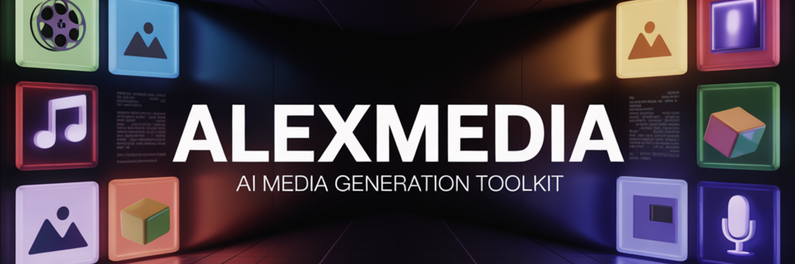

<div align="center">



**CLI toolkit for generating and editing media via [Replicate](https://replicate.com) — 83 AI models + 6 online 3D print services + 6 sticker print services, one CLI.**

</div>

---

## Setup

```bash
npm install
```

Create a `.env` file:

```
REPLICATE_API_TOKEN=r8_your_token_here
```

Get your token at [replicate.com/account/api-tokens](https://replicate.com/account/api-tokens).

## Scripts

| Script | Models | Description | Docs |
|--------|:------:|-------------|------|
| `generate-video.js` | 17 | Text/image-to-video generation | [docs/generate-video.md](docs/generate-video.md) |
| `generate-image.js` | 14 | Text/image-to-image generation | [docs/generate-image.md](docs/generate-image.md) |
| `generate-voice.js` | 15 | Text-to-speech & voice cloning | [docs/generate-voice.md](docs/generate-voice.md) |
| `generate-music.js` | 5 | AI music generation | [docs/generate-music.md](docs/generate-music.md) |
| `generate-3d.js` | 6 | Text/image-to-3D model generation (STL for 3D printing) | [docs/generate-3d.md](docs/generate-3d.md) |
| `generate-emoji.js` | 4 | Custom emoji/sticker generation | [docs/generate-emoji.md](docs/generate-emoji.md) |
| `generate-edit-image.js` | 12 | Image editing & enhancement | [docs/generate-edit-image.md](docs/generate-edit-image.md) |
| `generate-edit-video.js` | 10 | Video editing & processing | [docs/generate-edit-video.md](docs/generate-edit-video.md) |
| `generate-3d-print.js` | 6 services | Upload to online 3D printing services & get quotes | [docs/generate-3d-print.md](docs/generate-3d-print.md) |
| `generate-sticker-print.js` | 6 services | Order physical stickers & prints from production services | [docs/generate-sticker-print.md](docs/generate-sticker-print.md) |

## Quick Start

```bash
# Generate a video
node generate-video.js "a cat playing piano"

# Generate an image
node generate-image.js "mountain landscape at sunset" --model flux2pro

# Text-to-speech
node generate-voice.js "Hello, how are you today?"

# Generate music
node generate-music.js "epic orchestral theme" --model stableaudio --duration 60

# Create a 3D model
node generate-3d.js "a medieval sword" --image ./sword.png

# Generate emoji
node generate-emoji.js "happy robot"

# Edit an image (remove background)
node generate-edit-image.js --model rembg --image ./photo.jpg

# Edit a video (trim)
node generate-edit-video.js --model trim --video ./clip.mp4 --start 5 --end 15

# Get 3D printing quotes
node generate-3d-print.js --file ./model.stl --service all

# Order physical stickers
node generate-sticker-print.js --file ./sticker.png --service all --type die-cut
```

Every script supports `--help` for full usage info:

```bash
node generate-video.js --help
```

## All Models

### Video Generation (17)

| Key | Model | Cost |
|-----|-------|------|
| `veo3fast` | Google Veo 3.1 Fast | $0.10–0.15/sec |
| `veo3` | Google Veo 3.1 | $0.20–0.40/sec |
| `grok` | xAI Grok Imagine Video | $0.05/sec |
| `gen45` | Luma Gen4.5 | $0.32/sec |
| `kling` | Kling v2.1 Pro | $0.17–0.22/sec |
| `kling26` | Kling v2.6 Master | $0.17–0.22/sec |
| `kling3omni` | Kling v3 Omni | $0.17–0.22/sec |
| `sora` | OpenAI Sora 2 | $0.10/sec |
| `sora2pro` | OpenAI Sora 2 Pro | $0.30–0.50/sec |
| `seedance` | ByteDance Seedance 1.0 | $0.06/sec |
| `seedpro` | ByteDance Seedance 1.0 Pro | $0.15/sec |
| `pixverse` | PixVerse v4.5 | $0.05/sec |
| `hailuo` | MiniMax Hailuo | variable |
| `hailuo23` | MiniMax Hailuo 2.3 | variable |
| `ray2` | Luma Ray 2 | $0.30/sec |
| `rayflash` | Luma Ray 2 Flash | $0.025/sec |
| `wan` | Wan 2.1 | per-second GPU |

### Image Generation (14)

| Key | Model | Cost |
|-----|-------|------|
| `nanapro` | Nano Banana Pro | per-second GPU |
| `gptimage` | GPT-Image-1 | $0.02–0.19/image |
| `imagen4` | Google Imagen 4 | $0.03/image |
| `imagen4u` | Google Imagen 4 Ultra | $0.06/image |
| `imagen4f` | Google Imagen 4 Fast | $0.02/image |
| `flux2max` | Flux 2 Max | $0.08/image |
| `flux2pro` | Flux 2 Pro | $0.06/image |
| `seedream` | ByteDance SeedDream 3.0 | $0.03/image |
| `grok` | xAI Grok 2 Image | $0.07/image |
| `ideoturbo` | Ideogram V3 Turbo | $0.02/image |
| `ideoqual` | Ideogram V3 Quality | $0.08/image |
| `recraft` | Recraft V3 SVG | $0.04/image |
| `minimax` | MiniMax Image 01 | $0.02/image |
| `photon` | Luma Photon | $0.03/image |

### Voice / TTS (15)

| Key | Model | Cost |
|-----|-------|------|
| `mm28turbo` | MiniMax Speech 2.8 Turbo | $0.06/1K tokens |
| `mm28hd` | MiniMax Speech 2.8 HD | $0.10/1K tokens |
| `mm02turbo` | MiniMax Speech 02 Turbo | $0.06/1K tokens |
| `mm02hd` | MiniMax Speech 02 HD | $0.10/1K tokens |
| `mm26turbo` | MiniMax Speech 2.6 Turbo | $0.06/1K tokens |
| `mm26hd` | MiniMax Speech 2.6 HD | $0.10/1K tokens |
| `mmclone` | MiniMax Voice Cloning | $3/output |
| `chatterbox` | Resemble Chatterbox | $0.025/1K chars |
| `chatturbo` | Resemble Chatterbox Turbo | $0.025/1K chars |
| `chatpro` | Resemble Chatterbox Pro | $0.04/1K chars |
| `chatmlang` | Resemble Chatterbox Multilingual | variable |
| `qwentts` | Qwen3 TTS | $0.02/1K chars |
| `elevenv3` | ElevenLabs v3 | $0.10/1K chars |
| `eleventurbo` | ElevenLabs Turbo v2.5 | $0.05/1K chars |
| `kokoro` | Kokoro 82M | per-second GPU |

### Music (5)

| Key | Model | Cost |
|-----|-------|------|
| `music15` | MiniMax Music 1.5 | $0.03/file |
| `music01` | MiniMax Music 01 | $0.035/file |
| `stableaudio` | Stable Audio 2.5 | $0.20/file |
| `elevenmusic` | ElevenLabs Music | $8.30/1K sec |
| `lyria2` | Google Lyria 2 | $2/1K sec |

### 3D Generation (6)

| Key | Model | Cost |
|-----|-------|------|
| `trellis` | Microsoft TRELLIS | $0.10/run |
| `rodin` | Rodin Gen-2 | $0.50/run |
| `hunyuan` | Hunyuan3D 2.0 | $0.10/run |
| `hunyuan2mv` | Hunyuan3D 2.0 Multi-View | $0.10/run |
| `mvdream` | MVDream | per-second GPU |
| `shape` | Shap-E (OpenAI) | per-second GPU |

### Emoji (4)

| Key | Model | Cost |
|-----|-------|------|
| `sdxlemoji` | SDXL Emoji | per-second GPU |
| `platmoji` | Platmoji | per-second GPU |
| `fluxico` | Flux Emoji | per-second GPU |
| `kontextemoji` | Flux Kontext Max | $0.05/image |

### Image Editing (12)

| Key | Model | Cost |
|-----|-------|------|
| `nana` | Nano Inpaint | per-second GPU |
| `pedit` | InstructPix2Pix | per-second GPU |
| `kontext` | Flux Kontext Pro | $0.03/image |
| `kontextmax` | Flux Kontext Max | $0.05/image |
| `fillpro` | Flux Fill Pro | $0.05/image |
| `eraser` | Object Eraser | per-second GPU |
| `genfill` | Generative Fill | per-second GPU |
| `expand` | Image Outpainter | per-second GPU |
| `bggen` | Flux Background Gen | $0.04/image |
| `restore` | CodeFormer | per-second GPU |
| `rembg` | Background Remover | per-second GPU |
| `upscale` | Real-ESRGAN | per-second GPU |

### Video Editing (10)

| Key | Model / Engine | Cost |
|-----|---------------|------|
| `modify` | MiniMax Video-01 Live | $0.035/sec |
| `reframe` | FFmpeg (local) | free |
| `trim` | FFmpeg (local) | free |
| `merge` | FFmpeg (local) | free |
| `avmerge` | FFmpeg (local) | free |
| `extract` | FFmpeg (local) | free |
| `frames` | FFmpeg (local) | free |
| `upscale` | Clarity Upscaler | per-second GPU |
| `caption` | AutoCaption | per-second GPU |
| `utils` | FFmpeg (local) | free |

## Output

All scripts save results to `./media/` with:
- The generated/edited media file
- A JSON report with metadata (model, prompt, parameters, timing, cost)

## Project Structure

```
AlexVideos/
├── generate-video.js          # Video generation (17 models)
├── generate-image.js          # Image generation (14 models)
├── generate-voice.js          # TTS & voice cloning (15 models)
├── generate-music.js          # Music generation (5 models)
├── generate-3d.js             # 3D model generation (6 models)
├── generate-emoji.js          # Emoji generation (4 models)
├── generate-edit-image.js     # Image editing (12 models)
├── generate-edit-video.js     # Video editing (10 models)
├── generate-3d-print.js       # 3D print service integration (6 services)
├── generate-sticker-print.js  # Sticker print production (6 services)
├── package.json
├── .env                       # REPLICATE_API_TOKEN (not committed)
├── docs/                      # Per-script documentation & workflow guides
│   ├── generate-video.md
│   ├── generate-image.md
│   ├── generate-voice.md
│   ├── generate-music.md
│   ├── generate-3d.md
│   ├── generate-emoji.md
│   ├── generate-edit-image.md
│   ├── generate-edit-video.md
│   ├── generate-3d-print.md
│   ├── generate-sticker-print.md
│   ├── 3d-printing-services-guide.md
│   ├── 3d-design-to-print-workflow.md
│   ├── sticker-print-production-workflow.md
│   ├── video-production-workflow.md
│   ├── image-creation-workflow.md
│   ├── audio-production-workflow.md
│   └── emoji-sticker-workflow.md
└── media/                     # Generated media + JSON reports
```

## Dependencies

- [replicate](https://www.npmjs.com/package/replicate) ^1.4.0 — Replicate API client
- [dotenv](https://www.npmjs.com/package/dotenv) ^17.3.1 — Environment variable loading
- [@gltf-transform/core](https://www.npmjs.com/package/@gltf-transform/core) ^4.3.0 — GLB parsing for STL conversion
- [form-data](https://www.npmjs.com/package/form-data) — Multipart uploads to 3D print services
- [open](https://www.npmjs.com/package/open) — Browser handoff for print service uploads
- [FFmpeg](https://ffmpeg.org/) — Required for video editing operations (local processing)

## License

Private
