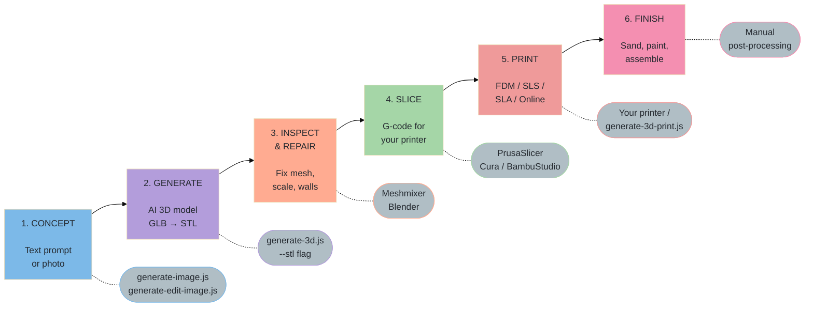
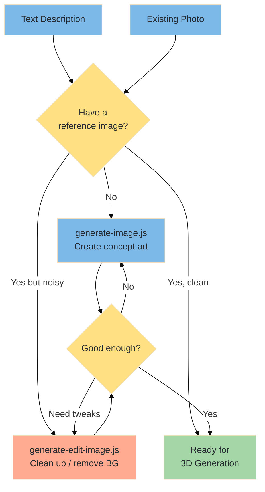
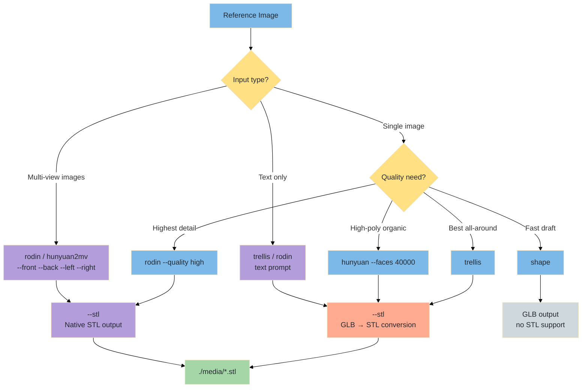
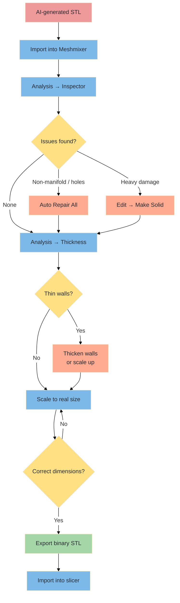
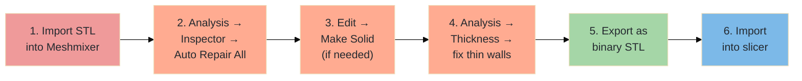
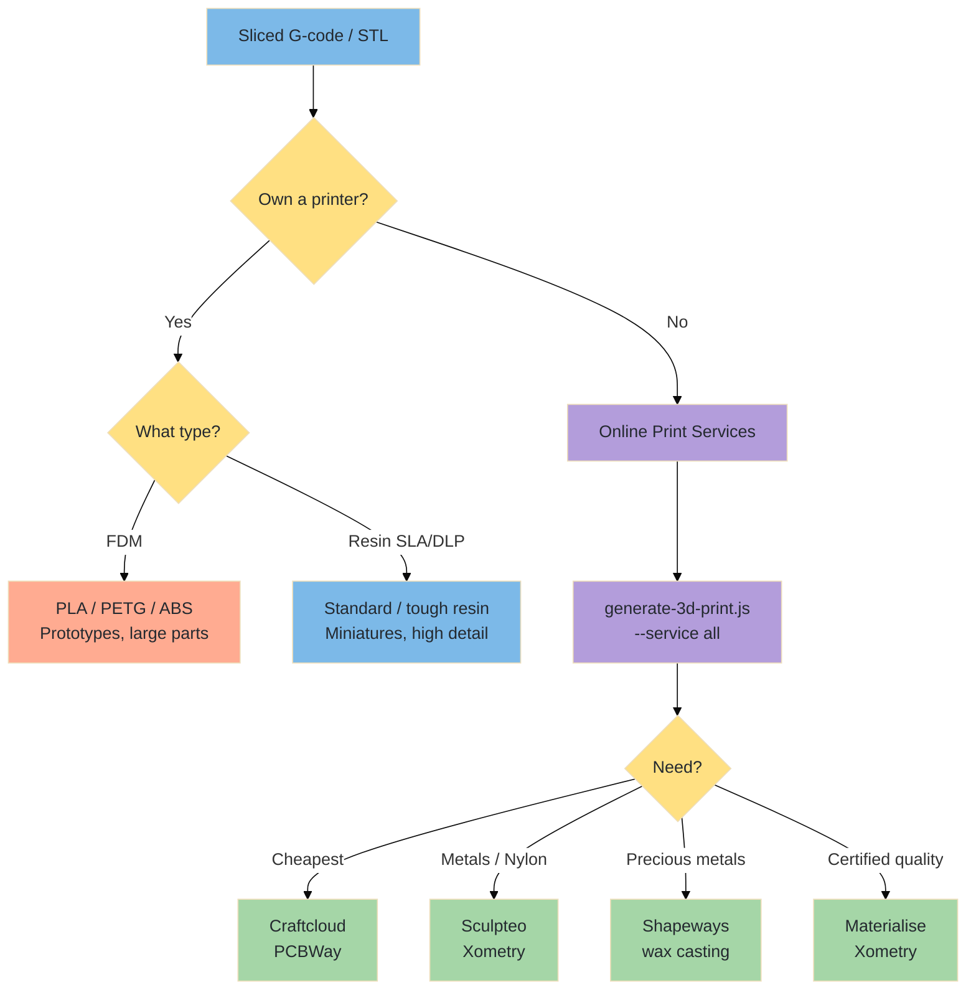
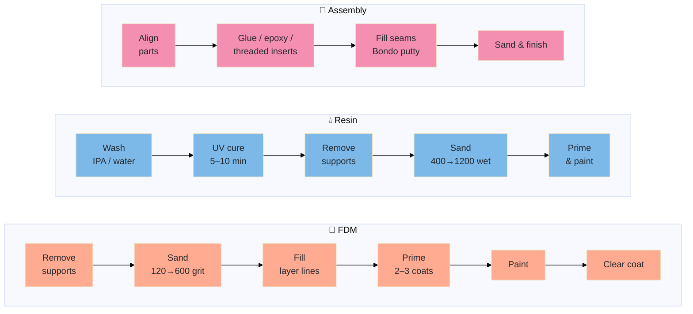
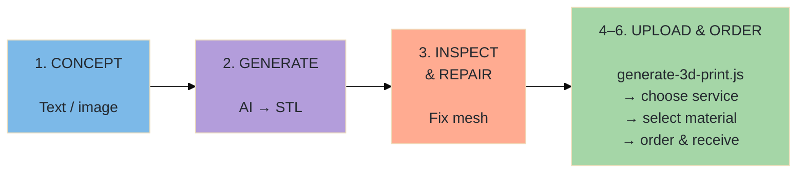

# From Idea to Physical Object — The Complete 3D Design-to-Print Workflow


A step-by-step manual covering the full pipeline: concept → reference image → AI-generated 3D model → print-ready file → slicing → physical print. Uses the AlexMedia CLI toolkit throughout.

---

## Table of Contents

1. [Workflow Overview](#workflow-overview)
2. [Phase 1 — Concept & Reference Art](#phase-1--concept--reference-art)
3. [Phase 2 — AI 3D Model Generation](#phase-2--ai-3d-model-generation)
4. [Phase 3 — Model Inspection & Repair](#phase-3--model-inspection--repair)
5. [Phase 4 — Slicing for Your Printer](#phase-4--slicing-for-your-printer)
6. [Phase 5 — Printing](#phase-5--printing)
7. [Phase 6 — Post-Processing](#phase-6--post-processing)
8. [Alternative — Online Print Services](#alternative--online-print-services)
9. [End-to-End Pipeline Examples](#end-to-end-pipeline-examples)
10. [Troubleshooting](#troubleshooting)
11. [Recommended Software](#recommended-software)

---

## Workflow Overview



---

## Phase 1 — Concept & Reference Art



Good 3D prints start with good references. AI-generated images give the 3D model something concrete to work from.

### 1a. Text-to-Image (Create Your Reference)

Generate reference images from a text description:

```bash
# Quick concept art
node generate-image.js "a small desk lamp shaped like a mushroom, clean white background, product photo" --model imagen4

# Multiple angles for complex objects
node generate-image.js "miniature fantasy castle, front view, white background, studio lighting" --model nanapro
node generate-image.js "miniature fantasy castle, side view, white background, studio lighting" --model nanapro
node generate-image.js "miniature fantasy castle, back view, white background, studio lighting" --model nanapro
```

### 1b. Edit Existing Images (Refine Your Reference)

Clean up or tweak reference images before sending to 3D generation:

```bash
# Remove background (critical for image-to-3D models)
node generate-edit-image.js --model rembg --image ./concept.jpg

# Upscale a low-res reference
node generate-edit-image.js --model upscale --image ./concept.jpg --scale 4

# Modify details
node generate-edit-image.js "remove the handle, make the base wider" --model kontext --image ./lamp.jpg
```

### Reference Image Best Practices

| Guideline | Why |
| ----------- | ----- |
| **White or plain background** | 3D models confuse busy backgrounds with geometry |
| **Single object, centered** | Multi-object scenes produce messy meshes |
| **Good lighting, no strong shadows** | Shadows create false depth / holes in mesh |
| **Multiple angles if possible** | Use Rodin / Hunyuan2mv multi-view for better accuracy |
| **Remove background beforehand** | Use `--model rembg` to isolate the subject |
| **Resolution ≥ 1024×1024** | Higher detail = better 3D reconstruction |
| **Avoid transparency / glass** | Transparent objects reconstruct poorly |

---

## Phase 2 — AI 3D Model Generation



### 2a. Choose Your Model

| Goal | Recommended Model | Command |
| ------ | ------------------- | --------- |
| Best all-around quality | `trellis` | `node generate-3d.js --model trellis --image ./ref.png --stl` |
| Highest detail, PBR materials | `rodin` | `node generate-3d.js --model rodin --image ./ref.png --stl --quality high` |
| Multi-view precision | `hunyuan2mv` | `node generate-3d.js --model hunyuan2mv --front ./f.png --back ./b.png --stl` |
| Text-only (no reference image) | `trellis` or `rodin` | `node generate-3d.js "a gear wheel" --model rodin --stl` |
| Fast prototype / draft | `shape` | `node generate-3d.js "a chair" --model shape` |
| High-poly organic forms | `hunyuan` | `node generate-3d.js --model hunyuan --image ./sculpture.png --stl --faces 40000` |

### 2b. Generate with STL Output

Always use `--stl` when the goal is 3D printing:

```bash
# From image — Trellis (auto GLB→STL conversion)
node generate-3d.js --model trellis --image ./mushroom-lamp.png --stl

# From text — Rodin with native STL and high quality
node generate-3d.js "a chess rook piece" --model rodin --stl --quality high --meshmode Triangle

# From multi-view images — Hunyuan2mv
node generate-3d.js --model hunyuan2mv --front ./front.png --back ./back.png --left ./left.png --right ./right.png --stl
```

The `--stl` flag works in two ways:

- **Native STL models** (`rodin`, `hunyuan2mv`): Requests STL directly from the API
- **Other models** (`trellis`, `hunyuan`, etc.): Downloads GLB, then converts locally to STL

Output lands in `./media/` as both the 3D file and a JSON report with generation metadata.

### 2c. Tips for Print-Ready Generation

| Tip | Detail |
| ----- | -------- |
| Use `--quality high` or `extra-high` on Rodin | Higher quality = denser mesh = smoother prints |
| Use `--faces 40000` or higher on Hunyuan | More faces = smoother curves |
| Use `--meshmode Triangle` on Rodin | Ensures manifold triangle mesh (slicers prefer this) |
| Generate at largest reasonable size | Scaling up a low-poly model exposes facets |
| Try multiple models | Different AI models handle different shapes better |

---

## Phase 3 — Model Inspection & Repair



AI-generated meshes often have issues that will cause print failures. **Always inspect before slicing.**

### 3a. Common Mesh Issues

| Issue | Symptom in Slicer | Fix |
| ------- | ------------------- | ----- |
| **Non-manifold edges** | Slicer shows red/yellow warnings | Auto-repair in Meshmixer or PrusaSlicer |
| **Holes in mesh** | Missing walls in slice preview | Fill holes in Meshmixer (Analysis → Inspector) |
| **Inverted normals** | Slicer treats solid as hollow | Flip normals in Blender (Mesh → Normals → Recalculate) |
| **Zero-thickness walls** | Disappearing geometry in slice | Thicken walls with Solidify modifier in Blender |
| **Self-intersections** | Random internal infill artifacts | Boolean union in Meshmixer or Blender |
| **Missing escape holes** | Uncured resin / trapped powder inside hollow parts | Add ≥ 3.5 mm drain holes for SLA; escape holes for SLS |
| **Too few polygons** | Visible faceting on curved surfaces | Subdivide mesh or regenerate with higher face count |
| **Wrong scale** | Model is microscopic or huge | Scale to real-world dimensions (see 3b) |

### 3b. Scale to Real-World Dimensions

AI models have no inherent scale. You **must** set the physical size.

**In PrusaSlicer / Cura / BambuStudio:**

1. Import STL
2. Look at the dimensions panel (usually bottom-right)
3. Scale uniformly until the longest axis matches your desired real size
4. Lock aspect ratio to prevent distortion

**Common scales:**

| Object Type | Typical Size | Scale Factor (from ~10cm AI output) |
| ------------- | ------------- | -------------------------------------- |
| Miniature / figurine | 25–35 mm tall | 0.25–0.35× |
| Chess piece | 40–80 mm tall | 0.4–0.8× |
| Desk ornament | 80–150 mm | 0.8–1.5× |
| Functional part | Varies | Measure and set exactly |
| Architectural model | 200–500 mm | 2–5× |

### 3c. Wall Thickness Check

Thin walls are the #1 cause of failed prints. Minimum wall thickness depends on technology:

| Technology | Minimum Wall | Recommended Wall |
| ------------ | ------------- | ----------------- |
| FDM | 1.2 mm (3 perimeters × 0.4 mm nozzle — adjust for your nozzle size) | 1.6–2.0 mm |
| SLS / MJF | 0.8 mm | 1.2–1.5 mm |
| SLA / DLP | 0.6 mm | 1.0–1.5 mm |
| DMLS (metal) | 1.0 mm | 1.5–2.0 mm |

Use Meshmixer's **Analysis → Thickness** to visualize thin areas, or PrusaSlicer's slice preview to spot vanishing geometry.

### 3d. Recommended Repair Workflow



For quick fixes only, most slicers can auto-repair on import:

- **PrusaSlicer**: Automatically repairs on import (check console log)
- **Cura**: Mesh Fixes → Union Overlapping Volumes
- **BambuStudio**: Automatic repair on import

---

## Phase 4 — Slicing for Your Printer

Slicing converts your 3D model into G-code (movement instructions for your printer).

### 4a. Slicer Settings for AI-Generated Models

AI meshes are often irregular. These settings help compensate:

| Setting | Recommended Value | Why |
| --------- | ------------------- | ----- |
| **Layer height** | 0.16–0.20 mm | Good balance of detail and speed |
| **Perimeters / walls** | 3–4 | Compensates for thin-wall issues |
| **Infill** | 15–20% (gyroid or grid) | Enough strength without wasting material |
| **Supports** | Yes — tree supports preferred | AI models often have overhangs |
| **Support angle** | 45° | Standard overhang threshold |
| **Brim** | Yes, 5–8 mm | Helps adhesion for small/irregular bases |
| **Speed** | 40–60 mm/s for outer walls | Slower = cleaner surface on irregular geometry |
| **Ironing** | On for flat top surfaces | Smooths visible top layers |
| **Detect thin walls** | Enabled | Critical for AI meshes with thin features |
| **Bridge detection** | Enabled | Bridges < 5 mm print OK; longer ones need support or speed reduction |

### 4b. Orientation Strategy

How you orient the model on the build plate dramatically affects quality:

| Priority | Strategy |
| ---------- | ---------- |
| **Minimize supports** | Rotate so overhangs face up or are ≤ 45° |
| **Best surface quality** | Put the most visible face away from the build plate |
| **Strength** | Layers should run perpendicular to stress direction |
| **Flat base** | Ensure a stable, flat contact area with the build plate |
| **Least visible layer lines** | Orient so layer lines are hidden on back/bottom |
| **SLA / DLP** | Tilt at angle to minimize z-axis cross-sectional area (reduces peel force, prevents failures) |
| **Vertical holes** | Orient critical holes along the z-axis; FDM vertical holes print slightly undersized — drill after if precision is needed |

### 4c. Slicer Preview Checklist

Before hitting "Print", inspect every layer in the slicer's preview:

- [ ] No missing geometry (compare to original model)
- [ ] Supports reach all overhangs
- [ ] No floating/unsupported islands
- [ ] Brim/raft present if base is small
- [ ] Estimated print time is reasonable
- [ ] Estimated filament/material usage is acceptable
- [ ] First layer looks good (proper squish, no gaps)

---

## Phase 5 — Printing



### 5a. Home / Desktop Printer

| Technology | Printer Examples | Best For | Material Cost |
| ------------ | ----------------- | ---------- | --------------- |
| **FDM** | Bambu Lab P1S, Prusa MK4S, Ender 3 | Prototypes, large parts | $15–30/kg |
| **Resin (SLA/DLP)** | Elegoo Saturn 4, Anycubic Photon | High detail, miniatures | $30–60/L |

**FDM Tips for AI Models:**

- Use PLA for initial test prints (easiest to work with)
- PETG for functional parts (stronger, heat-resistant)
- Enable "Detect Thin Walls" in slicer settings
- Tree supports remove more cleanly than grid supports
- Print a small-scale test (50%) first to catch issues early

**Resin Tips for AI Models:**

- Best for miniatures and high-detail objects
- Anti-aliasing ON for smoother curved surfaces
- Hollow the model to save resin (minimum 2 mm wall thickness)
- Add drainage holes (≥ 3.5 mm diameter) so uncured resin can escape
- UV cure for 15–60 minutes after washing (check your resin's datasheet — time varies by resin type and UV lamp power)

### 5b. Online Print Services

Skip the printer entirely — upload your STL and get it professionally printed:

```bash
# Get instant quotes from all integrated services
node generate-3d-print.js --file ./media/model.stl --service all

# Compare pricing on Craftcloud (aggregates 150+ manufacturers)
node generate-3d-print.js --file ./media/model.stl --service craftcloud

# Get specific material pricing from Sculpteo (no account needed)
node generate-3d-print.js --file ./media/model.stl --service sculpteo --material nylon

# Budget-friendly printing via PCBWay
node generate-3d-print.js --file ./media/model.stl --service pcbway
```

**When to use online services:**

- You don't own a printer
- You need metal, nylon, or specialty materials
- You need certified / production-grade quality
- You want multiple copies (batch pricing)
- You need larger build volume than your printer

See [3d-printing-services-guide.md](3d-printing-services-guide.md) for detailed pricing, materials, and service comparison.

---

## Phase 6 — Post-Processing



### 6a. FDM Post-Processing

| Step | Method | When |
| ------ | -------- | ------ |
| **Support removal** | Needle-nose pliers, flush cutters | Always (if supports used) |
| **Sanding** | 120 → 220 → 400 → 600 grit | When surface finish matters |
| **Filling layer lines** | Bondo spot putty or filler primer | Cosmetic pieces |
| **Priming** | Spray filler primer (2–3 coats) | Before painting |
| **Painting** | Acrylic paint, airbrush or brush | Cosmetic / display pieces |
| **Clear coat** | Spray polyurethane or lacquer | Protection and gloss |
| **Acetone vapor smoothing** | ABS only — acetone vapor bath | Ultra-smooth ABS surface |
| **Epoxy coating** | Thin epoxy brush coat | Waterproofing, glass-smooth finish |

### 6b. Resin Post-Processing

| Step | Method | When |
| ------ | -------- | ------ |
| **Washing** | IPA or water (water-washable resin) | Always — 5–10 min (ultrasonic) or 10–20 min (manual agitation) |
| **UV curing** | UV lamp / sunlight, 15–60 min (per resin datasheet) | Always — hardens the surface |
| **Support removal** | Flush cutters (before or after cure) | Always |
| **Sanding** | 400 → 800 → 1200 grit (wet) | For glass-smooth finish |
| **Priming & painting** | Same as FDM | Display pieces |

### 6c. Assembly (Multi-Part Prints)

For objects too large for one print, or models with moving parts:

| Join Method | Best For | Strength |
| ------------- | ---------- | ---------- |
| **Super glue (CA)** | Small parts, PLA, quick bond | Medium |
| **Epoxy** | Structural joints, load-bearing | High |
| **Friction welding** (3D pen) | PLA-to-PLA, gap filling | Medium-High |
| **Threaded inserts** | Reusable mechanical joints | Very High |
| **Press-fit pins** | Alignment + moderate strength | Medium |
| **Screws** | Functional parts, disassembly needed | High |

---

## Alternative — Online Print Services

If you don't have a printer, Phases 4–6 are replaced by a single upload:



```bash
# Full pipeline: concept → reference image → 3D model → print quote
node generate-image.js "geometric desk organizer, white background" --model imagen4
node generate-edit-image.js --model rembg --image ./media/*imagen*.png
node generate-3d.js --model trellis --image ./media/*rembg*.png --stl
node generate-3d-print.js --file ./media/*trellis*.stl --service all
```

---

## End-to-End Pipeline Examples

### Example 1 — Miniature Figurine (Home FDM Printer)

```bash
# 1. Generate reference image
node generate-image.js "a cute wizard figurine holding a staff, white background, product photo" --model nanapro

# 2. Clean up the reference
node generate-edit-image.js --model rembg --image ./media/*nanapro*.png

# 3. Generate 3D model with STL
node generate-3d.js --model trellis --image ./media/*rembg*.png --stl

# 4. Open STL in PrusaSlicer
#    - Scale to 35mm tall
#    - Layer height: 0.12mm (detail)
#    - Add tree supports
#    - 20% infill
#    - Enable "Detect Thin Walls"
#    - Slice → Export G-code → Print

# 5. Post-process
#    - Remove supports with flush cutters
#    - Light sanding at 400 grit
#    - Prime and paint with acrylics
```

### Example 2 — Functional Gear (Online Service, Nylon SLS)

```bash
# 1. Generate 3D model directly from text
node generate-3d.js "an involute spur gear with 24 teeth" --model rodin --stl --quality extra-high --meshmode Triangle

# 2. Inspect in Meshmixer → repair if needed → confirm dimensions

# 3. Get production quotes
node generate-3d-print.js --file ./media/*rodin*.stl --service sculpteo --material nylon
node generate-3d-print.js --file ./media/*rodin*.stl --service xometry

# 4. Order SLS Nylon PA12 from best-priced service
#    Expected: $15–40 depending on size
#    Lead time: 5–10 business days
```

### Example 3 — Jewelry Piece (Shapeways Wax Casting)

```bash
# 1. Generate reference from multiple angles
node generate-image.js "elegant silver ring with Celtic knot pattern, product photo, white background" --model ideoqual
node generate-image.js "same ring from side view" --model ideoqual

# 2. Generate high-detail 3D model
node generate-3d.js --model rodin --image ./media/*ideoqual*.png --stl --quality extra-high --faces 60000

# 3. Upload to Shapeways for precious metal casting
node generate-3d-print.js --file ./media/*rodin*.stl --service shapeways --material silver

# 4. Order in Sterling Silver via lost-wax casting
#    Expected: $50–150+ depending on size/weight
#    Lead time: 10–15 business days
```

### Example 4 — Large Display Piece (Multi-Part FDM)

```bash
# 1. Generate reference
node generate-image.js "detailed dragon sculpture, T-pose, white background" --model nanapro

# 2. Generate 3D model
node generate-3d.js --model rodin --image ./media/*nanapro*.png --stl --quality high --tpose

# 3. In Meshmixer:
#    - Repair mesh (Analysis → Inspector → Auto Repair)
#    - Scale to 300mm
#    - Edit → Plane Cut to split into printable sections
#    - Add alignment pins at cut points
#    - Export each section as separate STL

# 4. Slice each section separately in PrusaSlicer
#    - 0.20mm layer height
#    - 15% infill
#    - Tree supports
#    - PETG for strength

# 5. Post-process
#    - Glue sections with epoxy
#    - Fill seams with Bondo
#    - Sand → prime → paint → clear coat
```

---

## Troubleshooting

### Generation Issues

| Problem | Cause | Solution |
| --------- | ------- | ---------- |
| 3D model looks nothing like the reference | Poor reference image | Use clean background, centered object, good lighting |
| Model is very low-poly / blocky | Low face count | Use `--faces 40000+` or `--quality high` |
| Missing features (holes, thin parts) | AI couldn't interpret thin geometry | Try a different model, or edit the reference to exaggerate features |
| Model has random extra geometry | Background artifacts in reference image | Use `--model rembg` to remove background first |
| Generation failed / timed out | Model overloaded or complex prompt | Retry; simplify the prompt; try a different model |

### Print Issues

| Problem | Cause | Solution |
| --------- | ------- | ---------- |
| Slicer shows warnings / red areas | Non-manifold mesh | Repair in Meshmixer (Analysis → Inspector) |
| Nothing prints / empty G-code | Mesh is too small or inverted normals | Scale up; recalculate normals in Blender |
| Supports won't detach cleanly | Wrong support type or too dense | Switch to tree supports; increase Z distance |
| Thin features missing in print | Walls below minimum thickness | Scale up or thicken walls in Blender/Meshmixer |
| Spaghetti / failed mid-print | Overhangs without supports | Add supports; reorient model on build plate |
| Stringing / oozing between parts | Retraction too low or temp too high | Increase retraction distance (1–2 mm direct drive, 4–6 mm Bowden); lower nozzle temp 5–10°C |
| Poor bridging / sagging | Bridge span > 5 mm without support | Enable bridge detection; reduce bridge speed to 15–25 mm/s; or add support |
| Layer shifting | Mechanical issue or model too tall/thin | Check belt tension; add brim for stability |
| Elephant's foot (bulge at base) | First layer squished too much | Raise Z offset slightly; add chamfer to base |

### Online Service Issues

| Problem | Cause | Solution |
| --------- | ------- | ---------- |
| "File not printable" error | Non-manifold or degenerate mesh | Repair mesh before uploading |
| Price is extremely high | Model too large or too much volume | Hollow the model; reduce scale; try different material |
| "Minimum wall thickness" warning | Thin walls below service tolerance | Thicken walls to ≥ 1.0 mm |
| STL upload rejected | File too large or wrong format | Keep under 100 MB; ensure binary STL (not ASCII) |

### CLI / Script Issues (generate-3d.js)

| Problem | Cause | Solution |
| --------- | ------- | ---------- |
| `404 Not Found` on predictions | Community model called without version hash | Pin `owner/model:sha256hash` — fetch latest hash from `/v1/models/owner/model/versions` |
| `url.startsWith is not a function` | Replicate SDK returns `FileOutput` objects, not strings | Normalize via `String(item)` — `FileOutput.toString()` returns the URL |
| `mesh_mode must be one of Quad, Raw` | `--meshmode Triangle` is invalid for Rodin | Use `--meshmode Quad` (clean topology) or `--meshmode Raw` (max detail) |
| Sculpteo name too long (422) | Filename stem > 64 chars | Truncate to 64 chars — already fixed in `generate-3d-print.js` |

### Scale Issues (Critical — affects every workflow)

**AI 3D models always output a ~1mm bounding box.** The model contains no real-world scale information. Always scale before slicing or ordering.

**Quick CLI scale** (no extra tools needed):

```bash
# After generating, scale with Node.js inline — example for 120mm tall object
node -e "
const fs=require('fs'),src='./media/model.stl',dst='./media/model-print-ready.stl';
const buf=fs.readFileSync(src),n=buf.readUInt32LE(80);
let mx=0;
for(let i=0;i<n;i++){const b=84+i*50+12;for(let v=0;v<3;v++){mx=Math.max(mx,Math.abs(buf.readFloatLE(b+v*12)),Math.abs(buf.readFloatLE(b+v*12+4)),Math.abs(buf.readFloatLE(b+v*12+8)))}}
const sc=120/mx,out=Buffer.from(buf);
for(let i=0;i<n;i++){const b=84+i*50+12;for(let f=0;f<9;f++)out.writeFloatLE(buf.readFloatLE(b+f*4)*sc,b+f*4)}
fs.writeFileSync(dst,out);console.log('Scaled '+mx.toFixed(3)+'mm → 120mm, saved '+dst);
"
```

Or open in PrusaSlicer → right-click model → Scale → set Z to 120mm → lock aspect ratio → Export as STL.

---

## Recommended Software

### Free

| Software | Purpose | Platform |
| ---------- | --------- | ---------- |
| [PrusaSlicer](https://www.prusa3d.com/prusaslicer/) | FDM/SLA slicing, auto-repair | Windows, Mac, Linux |
| [Cura](https://ultimaker.com/software/ultimaker-cura/) | FDM slicing, extensive plugin ecosystem | Windows, Mac, Linux |
| [BambuStudio](https://bambulab.com/en/download/studio) | FDM slicing (Bambu Lab printers) | Windows, Mac |
| [Meshmixer](https://meshmixer.com/) | Mesh repair, analysis, sculpting | Windows, Mac |
| [Blender](https://www.blender.org/) | Full 3D modeling, sculpting, repair | Windows, Mac, Linux |
| [3D Builder](https://apps.microsoft.com/detail/9wzdncrfj3t6) | Quick STL viewing and basic repair | Windows |

### Online

| Tool | Purpose | URL |
| ------ | --------- | ----- |
| [Tinkercad](https://www.tinkercad.com/) | Beginner-friendly 3D modeling | Browser |
| [MeshLab](https://www.meshlab.net/) | Mesh processing and repair | Windows, Mac, Linux |
| [3D Viewer Online](https://3dviewer.net/) | Quick STL/OBJ/GLB preview | Browser |

---

## Quick Reference Card

```text
GENERATE REFERENCE IMAGE
  node generate-image.js "<description>, white background" --model imagen4

REMOVE BACKGROUND
  node generate-edit-image.js --model rembg --image ./media/<file>.png

GENERATE 3D MODEL (with STL for printing)
  node generate-3d.js --model trellis --image ./media/<file>.png --stl
  node generate-3d.js --model rodin "<description>" --stl --quality high

INSPECT & REPAIR
  Open in Meshmixer → Analysis → Inspector → Auto Repair All

SLICE
  Open in PrusaSlicer / Cura → Scale → Orient → Supports → Slice → G-code

PRINT LOCALLY
  Send G-code to printer via USB / SD / Wi-Fi

PRINT ONLINE
  node generate-3d-print.js --file ./media/<file>.stl --service all
```

---

*See also: [generate-3d.md](generate-3d.md) · [generate-3d-print.md](generate-3d-print.md) · [3d-printing-services-guide.md](3d-printing-services-guide.md)*
