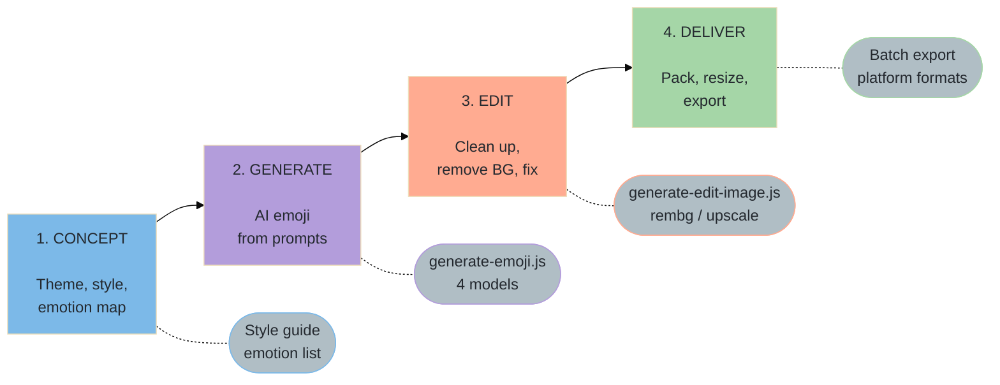
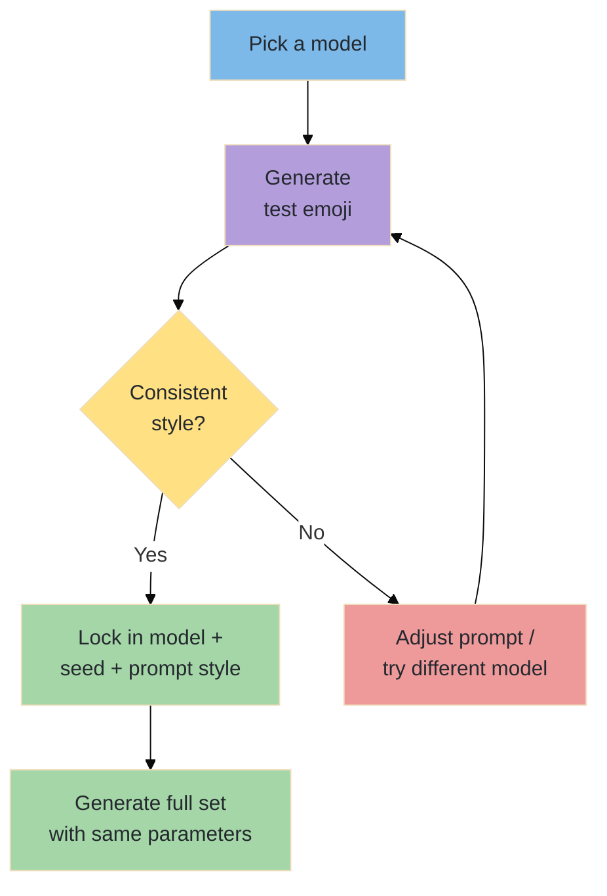
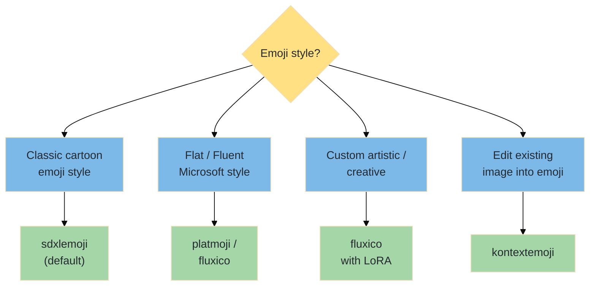
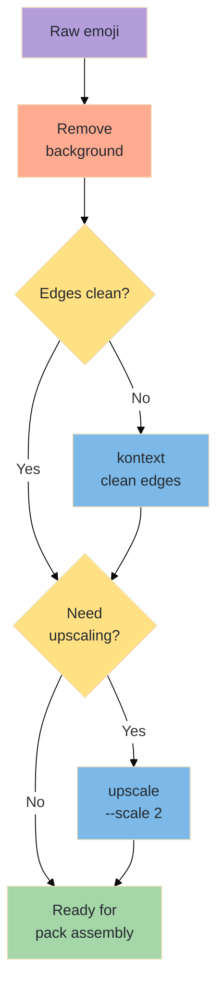

# From Idea to Pack — The Complete Emoji & Sticker Workflow

A step-by-step manual covering the full pipeline: concept → generate → edit & clean → organize → deliver. Uses the AlexVideos CLI toolkit throughout.

---

## Table of Contents

1. [Workflow Overview](#workflow-overview)
2. [Phase 1 — Concept & Style Guide](#phase-1--concept--style-guide)
3. [Phase 2 — Emoji Generation](#phase-2--emoji-generation)
4. [Phase 3 — Editing & Cleanup](#phase-3--editing--cleanup)
5. [Phase 4 — Pack Assembly & Delivery](#phase-4--pack-assembly--delivery)
6. [End-to-End Pipeline Examples](#end-to-end-pipeline-examples)
7. [Troubleshooting](#troubleshooting)
8. [Model Selection Guide](#model-selection-guide)

---

## Workflow Overview



---

## Phase 1 — Concept & Style Guide

### 1a. Define Your Emoji/Sticker Pack

| Question | Example Answers |
|----------|----------------|
| **What's the theme?** | Animals, food, office life, emotions, custom brand mascot |
| **How many emojis?** | Starter pack: 12–16, Full pack: 24–48, Extension: 6–12 |
| **Target platform?** | Discord, Slack, Telegram, iMessage, WhatsApp, Twitch |
| **Style?** | Cartoon, pixel art, 3D, flat design, hand-drawn, Fluent/Microsoft |
| **Subject?** | Character (consistent), objects (varied), abstract (emotions) |
| **Transparent background?** | Yes (almost always for stickers and emoji) |

### 1b. Plan Your Emotion Map

A good emoji pack covers core emotions and common reactions:

| Category | Emotions / Reactions |
|----------|---------------------|
| **Happy** | Smile, laugh, love, excited, party, thumbs up |
| **Sad** | Crying, disappointed, heartbroken, tired |
| **Angry** | Furious, annoyed, eye-roll, frustrated |
| **Surprise** | Shocked, wow, mind-blown, gasp |
| **Actions** | Waving, thinking, sleeping, eating, celebrating |
| **Reactions** | OK, no, yes, fire, 100, clap, facepalm |
| **Custom** | Brand-specific gestures, inside jokes, catchphrases |

### 1c. Style Consistency Rules



**Keys to consistency:**
- **Same model** for all emojis in a pack
- **Same seed** when possible (some models support it)
- **Same prompt structure**: "emoji of [character] [emotion/action], [style], white background"
- **Same dimensions**: Use `--width` and `--height` consistently (e.g., 512×512)

---

## Phase 2 — Emoji Generation

### 2a. Model Selection



### 2b. Generate Classic Emoji

```bash
# Default model — SDXL Emoji (classic cartoon emoji style)
node generate-emoji.js "happy cat waving"
node generate-emoji.js "cat crying tears of joy"
node generate-emoji.js "cat with heart eyes"
node generate-emoji.js "angry cat with steam"

# Use seed for consistent character appearance
node generate-emoji.js "happy orange tabby cat waving" --seed 42
node generate-emoji.js "sad orange tabby cat crying" --seed 42
node generate-emoji.js "excited orange tabby cat celebrating" --seed 42
```

### 2c. Generate Platform-Specific Styles

```bash
# Microsoft Fluent / 3D style — PlatMoji
node generate-emoji.js "smiling robot" --model platmoji
node generate-emoji.js "robot thinking" --model platmoji
node generate-emoji.js "robot celebrating" --model platmoji

# Custom artistic style — FluxICO (supports LoRA fine-tuning)
node generate-emoji.js "kawaii pizza slice smiling" --model fluxico
node generate-emoji.js "kawaii pizza slice crying" --model fluxico --lora "https://example.com/kawaii-lora.safetensors"
```

### 2d. Convert Existing Images to Emoji

```bash
# Turn a photo or illustration into emoji style
node generate-emoji.js "convert to happy emoji style" --model kontextemoji --image ./input/my-photo.png

# Turn a product into an emoji
node generate-emoji.js "make this a cute cartoon emoji" --model kontextemoji --image ./input/product.png
```

### 2e. Batch Generation Strategies

```bash
# Generate a full emotion set for a character
CHAR="round blue alien with big eyes"

node generate-emoji.js "$CHAR smiling happily" --seed 100 --width 512 --height 512
node generate-emoji.js "$CHAR laughing with tears" --seed 100 --width 512 --height 512
node generate-emoji.js "$CHAR crying sadly" --seed 100 --width 512 --height 512
node generate-emoji.js "$CHAR angry with red face" --seed 100 --width 512 --height 512
node generate-emoji.js "$CHAR surprised with wide eyes" --seed 100 --width 512 --height 512
node generate-emoji.js "$CHAR thinking with hand on chin" --seed 100 --width 512 --height 512
node generate-emoji.js "$CHAR sleeping with zzz" --seed 100 --width 512 --height 512
node generate-emoji.js "$CHAR waving hello" --seed 100 --width 512 --height 512
node generate-emoji.js "$CHAR giving thumbs up" --seed 100 --width 512 --height 512
node generate-emoji.js "$CHAR heart eyes in love" --seed 100 --width 512 --height 512
node generate-emoji.js "$CHAR facepalm" --seed 100 --width 512 --height 512
node generate-emoji.js "$CHAR party horn celebrating" --seed 100 --width 512 --height 512
```

### 2f. Generation Best Practices

| Practice | Detail |
|----------|--------|
| **Always specify "white background"** | Makes background removal cleaner in Phase 3 |
| **Square dimensions** | 512×512 is standard; avoids cropping at delivery |
| **Same seed for character** | Helps maintain visual consistency across a pack |
| **Simple descriptions** | "happy cat waving" > "a cute cartoon feline character expressing joy by moving its paw" |
| **Include character traits** | "orange tabby cat with green eyes" — describe the character once, reuse |
| **One emotion per emoji** | Each emoji should express a single clear emotion or action |
| **Avoid complex backgrounds** | Emoji should be subject-only; backgrounds are removed later |

---

## Phase 3 — Editing & Cleanup

### 3a. Remove Background

Almost all emoji and stickers need transparent backgrounds:

```bash
# Remove background for clean sticker
node generate-edit-image.js --model rembg --image ./media/*emoji*.png

# Process all emojis in batch (PowerShell)
Get-ChildItem ./media/*emoji*.png | ForEach-Object {
    node generate-edit-image.js --model rembg --image $_.FullName
}
```

### 3b. Clean Up Details

```bash
# Fix edges or details with prompt-based editing
node generate-edit-image.js "clean up the edges, make the outline crisp" --model kontext --image ./media/*rembg*.png

# Upscale if needed for high-DPI displays
node generate-edit-image.js --model upscale --image ./media/*rembg*.png --scale 2
```

### 3c. Cleanup Decision Tree



---

## Phase 4 — Pack Assembly & Delivery

### 4a. Platform Size Requirements

| Platform | Size | Format | Max File Size | Notes |
|----------|------|--------|---------------|-------|
| **Discord** | 128×128 px | PNG/GIF/JPG/WEBP | 256 KB | 50 static + 50 animated with boosts |
| **Slack** | 128×128 px | PNG/GIF/JPG | 128 KB | Square format required |
| **Telegram** | 512×512 px | WebP/PNG | 512 KB | Static sticker max 512 KB |
| **Telegram Animated** | 512×512 px | TGS (Lottie) | 64 KB | Vector animation only |
| **WhatsApp** | 512×512 px | WebP | 100 KB | Must have transparency |
| **iMessage** | Up to 618×618 px | PNG | — | Small, Medium, or Large |
| **Twitch** | 28×28 / 56×56 / 112×112 | PNG | 25 KB (each) | 3 sizes required |
| **Line** | 370×320 px | PNG | 1 MB | Main sticker: 370 wide, height ≤ 320 |

### 4b. Resize for Platform

```bash
# Resize using ImageMagick (install separately)
# Discord / Slack — 128×128
magick convert media/emoji-clean.png -resize 128x128 media/discord/emoji.png

# Telegram / WhatsApp — 512×512
magick convert media/emoji-clean.png -resize 512x512 media/telegram/emoji.png

# Twitch — all 3 required sizes
magick convert media/emoji-clean.png -resize 28x28 media/twitch/emoji-28.png
magick convert media/emoji-clean.png -resize 56x56 media/twitch/emoji-56.png
magick convert media/emoji-clean.png -resize 112x112 media/twitch/emoji-112.png

# Batch resize all (PowerShell + ImageMagick)
Get-ChildItem ./media/clean/*.png | ForEach-Object {
    magick convert $_.FullName -resize 128x128 "./media/discord/$($_.Name)"
    magick convert $_.FullName -resize 512x512 "./media/telegram/$($_.Name)"
}
```

### 4c. Convert to WebP (Telegram / WhatsApp)

```bash
# Convert PNG to WebP for Telegram/WhatsApp
magick convert media/emoji.png -define webp:lossless=true media/emoji.webp

# Batch convert
Get-ChildItem ./media/telegram/*.png | ForEach-Object {
    magick convert $_.FullName "$($_.DirectoryName)\$($_.BaseName).webp"
}
```

### 4d. Pack Organization

Organize your emoji pack into a clean directory structure:

```
emoji-pack/
├── source/              # Original high-res PNGs (512×512+)
│   ├── happy.png
│   ├── sad.png
│   └── ...
├── discord/             # 128×128 PNG
│   ├── happy.png
│   └── ...
├── telegram/            # 512×512 WebP
│   ├── happy.webp
│   └── ...
├── twitch/              # Three sizes
│   ├── happy-28.png
│   ├── happy-56.png
│   ├── happy-112.png
│   └── ...
└── manifest.json        # Pack metadata
```

### 4e. Delivery Checklist

- [ ] All emojis have consistent style
- [ ] All backgrounds removed (transparent PNG)
- [ ] Resized for target platform(s)
- [ ] File sizes within platform limits
- [ ] Naming convention applied (no spaces, lowercase)
- [ ] Core emotions covered (happy, sad, angry, surprised, reactions)
- [ ] Tested at actual display size (small emojis should be readable)

---

## End-to-End Pipeline Examples

### Example 1 — Discord Server Emoji Pack (12 emojis)

```bash
# 1. Generate a character set
CHAR="cute round robot with antenna"

node generate-emoji.js "$CHAR smiling happily, white background" --seed 42 --width 512 --height 512
node generate-emoji.js "$CHAR laughing hard, white background" --seed 42 --width 512 --height 512
node generate-emoji.js "$CHAR crying sadly, white background" --seed 42 --width 512 --height 512
node generate-emoji.js "$CHAR very angry, white background" --seed 42 --width 512 --height 512
node generate-emoji.js "$CHAR shocked surprised, white background" --seed 42 --width 512 --height 512
node generate-emoji.js "$CHAR thinking deeply, white background" --seed 42 --width 512 --height 512
node generate-emoji.js "$CHAR sleeping peacefully, white background" --seed 42 --width 512 --height 512
node generate-emoji.js "$CHAR waving hello, white background" --seed 42 --width 512 --height 512
node generate-emoji.js "$CHAR thumbs up, white background" --seed 42 --width 512 --height 512
node generate-emoji.js "$CHAR heart eyes love, white background" --seed 42 --width 512 --height 512
node generate-emoji.js "$CHAR facepalm, white background" --seed 42 --width 512 --height 512
node generate-emoji.js "$CHAR party horn celebrating, white background" --seed 42 --width 512 --height 512

# 2. Remove backgrounds
Get-ChildItem ./media/*sdxlemoji*.png | ForEach-Object {
    node generate-edit-image.js --model rembg --image $_.FullName
}

# 3. Resize to 128×128 for Discord
New-Item -ItemType Directory -Path ./media/discord -Force
Get-ChildItem ./media/*rembg*.png | ForEach-Object {
    magick convert $_.FullName -resize 128x128 "./media/discord/$($_.Name)"
}

# 4. Upload to Discord server settings → Emoji
```

### Example 2 — Telegram Sticker Pack

```bash
# 1. Generate stickers in Fluent style
node generate-emoji.js "happy fox waving" --model platmoji --width 512 --height 512
node generate-emoji.js "fox giving thumbs up" --model platmoji --width 512 --height 512
node generate-emoji.js "fox crying" --model platmoji --width 512 --height 512
node generate-emoji.js "fox laughing" --model platmoji --width 512 --height 512
node generate-emoji.js "fox angry" --model platmoji --width 512 --height 512
node generate-emoji.js "fox heart eyes" --model platmoji --width 512 --height 512

# 2. Remove backgrounds
Get-ChildItem ./media/*platmoji*.png | ForEach-Object {
    node generate-edit-image.js --model rembg --image $_.FullName
}

# 3. Convert to WebP for Telegram
New-Item -ItemType Directory -Path ./media/telegram -Force
Get-ChildItem ./media/*rembg*.png | ForEach-Object {
    magick convert $_.FullName -resize 512x512 -define webp:lossless=true "./media/telegram/$($_.BaseName).webp"
}

# 4. Create pack via @Stickers bot on Telegram
```

### Example 3 — Brand Mascot Emoji from Existing Logo

```bash
# 1. Convert your brand mascot into emoji style
node generate-emoji.js "make this a smiling emoji, white background" --model kontextemoji --image ./brand/mascot.png
node generate-emoji.js "make this a thumbs up emoji, white background" --model kontextemoji --image ./brand/mascot.png
node generate-emoji.js "make this a thinking emoji, white background" --model kontextemoji --image ./brand/mascot.png

# 2. Clean up
Get-ChildItem ./media/*kontextemoji*.png | ForEach-Object {
    node generate-edit-image.js --model rembg --image $_.FullName
}

# 3. Resize for Slack (128×128)
New-Item -ItemType Directory -Path ./media/slack -Force
Get-ChildItem ./media/*rembg*.png | ForEach-Object {
    magick convert $_.FullName -resize 128x128 "./media/slack/$($_.Name)"
}
```

---

## Troubleshooting

### Generation Issues

| Problem | Cause | Solution |
|---------|-------|----------|
| Style inconsistent across pack | Different seeds or prompt structure | Use same seed, same model, same prompt template |
| Emoji too detailed/busy | Prompt too complex | Simplify: "happy cat" not "cute orange tabby cat with detailed fur texture smiling" |
| Background not clean white | Prompt didn't specify | Always end prompt with "white background" or "on white" |
| Character looks different each time | Seed not locked | Use `--seed` for consistency; same seed + similar prompt |
| Too many colors / clashing | Over-specified in prompt | Let the model choose colors; or specify "single color palette" |
| Emoji not readable at small size | Too much detail | Design for 128×128 readability; bold shapes, clear expressions |

### Editing Issues

| Problem | Cause | Solution |
|---------|-------|----------|
| Background removal leaves halo | Soft edges in original | Generate with hard edges on clean white; or manually clean in editor |
| Transparency lost in resize | Wrong format | Always export as PNG to preserve alpha; only convert to WebP at final step |
| Upscale added unwanted detail | Over-enhancement | Use 2x max; emojis should stay simple |

### Platform Issues

| Problem | Cause | Solution |
|---------|-------|----------|
| Discord rejects upload | File > 256 KB or wrong size | Resize to 128×128; compress PNG (`pngquant`) |
| Telegram sticker blurry | Source too low-res | Generate at 512×512; don't downscale then upscale |
| WhatsApp sticker rejected | No transparency or > 100 KB | Ensure alpha channel; compress WebP aggressively |
| Twitch emote unreadable | Too detailed for 28×28 | Design for small size; bold outlines, simple shapes |
| Slack emoji looks pixelated | Uploaded wrong size | Upload exactly 128×128; don't rely on Slack scaling |

---

## Model Selection Guide

### Emoji Generation Models

| Model | Style | Best For | Seed? |
|-------|-------|----------|-------|
| `sdxlemoji` (default) | Classic cartoon emoji | General purpose, expressive, familiar emoji style | Yes |
| `platmoji` | Microsoft Fluent / 3D | Professional, platform-native look, Fluent design | Yes |
| `fluxico` | Flexible / artistic | Custom styles, LoRA fine-tuning, creative freedom | Yes |
| `kontextemoji` | Photo-to-emoji | Converting existing images (logos, photos) into emoji | No |

### When to Use Each Model

| Scenario | Model |
|----------|-------|
| Standard emoji pack for any platform | `sdxlemoji` |
| Professional / corporate sticker set | `platmoji` |
| Custom artistic style with fine-tuning | `fluxico` |
| Turn brand mascot / photo into emoji | `kontextemoji` |
| Need the most consistent character across emotions | `sdxlemoji` + fixed seed |

### Supporting Edit Models

| Task | Model | Why |
|------|-------|-----|
| Remove background | `rembg` | Clean transparent PNG |
| Fix edges after BG removal | `kontext` | Prompt-based edge cleanup |
| Upscale for high-DPI | `upscale` | 2x for crisp detail |
| Minor detail fix | `pedit` | Fine-grained inpainting |

---

*See also: [generate-emoji.md](generate-emoji.md) · [generate-edit-image.md](generate-edit-image.md)*
