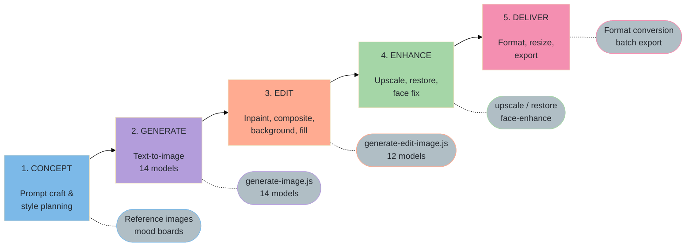
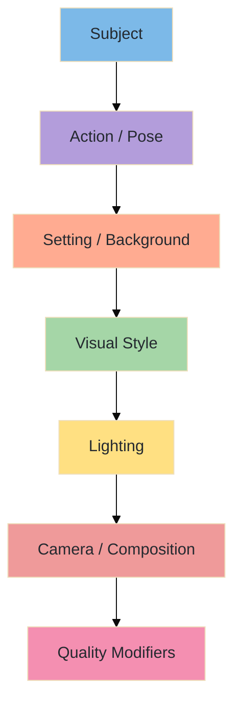
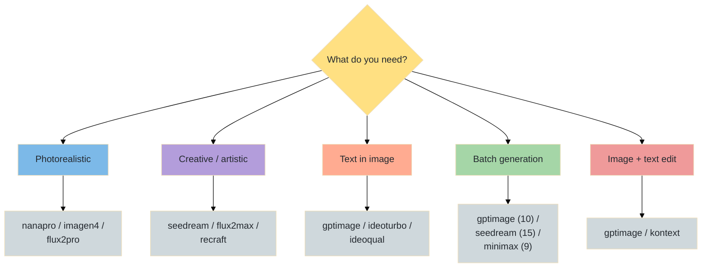
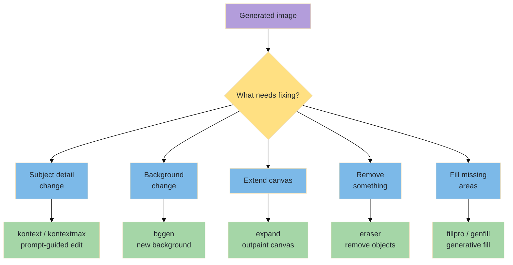
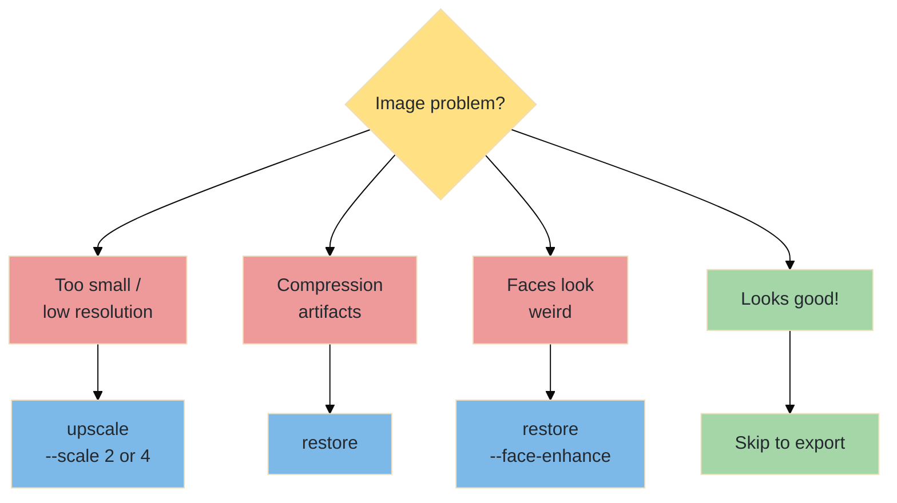

# From Concept to Canvas — The Complete Image Creation Workflow

A step-by-step manual covering the full pipeline: concept → generate → edit & enhance → upscale → deliver. Uses the AlexMedia CLI toolkit throughout.

---

## Table of Contents

1. [Workflow Overview](#workflow-overview)
2. [Phase 1 — Concept & Prompt Engineering](#phase-1--concept--prompt-engineering)
3. [Phase 2 — Image Generation](#phase-2--image-generation)
4. [Phase 3 — Image Editing & Compositing](#phase-3--image-editing--compositing)
5. [Phase 4 — Enhancement & Upscaling](#phase-4--enhancement--upscaling)
6. [Phase 5 — Export & Delivery](#phase-5--export--delivery)
7. [End-to-End Pipeline Examples](#end-to-end-pipeline-examples)
8. [Troubleshooting](#troubleshooting)
9. [Model Selection Guide](#model-selection-guide)

---

## Workflow Overview



---

## Phase 1 — Concept & Prompt Engineering

### 1a. Define Your Image

| Question | Example Answers |
|----------|----------------|
| **What is the image for?** | Social media post, product shot, hero banner, concept art, storyboard |
| **Style?** | Photorealistic, illustration, anime, minimalist, 3D render, oil painting |
| **Dimensions?** | 1:1 (Instagram), 16:9 (banner), 9:16 (story), 4:3 (presentation) |
| **Subject?** | Person, product, landscape, abstract, character, icon |
| **Mood / lighting?** | Warm golden hour, dramatic noir, soft pastel, neon cyberpunk |
| **Batch or single?** | Single hero image, or batch of variations |

### 1b. Prompt Anatomy



**Prompt formula**: `[Subject] + [Action/Pose] + [Setting] + [Style] + [Lighting] + [Camera] + [Quality]`

| Layer | Weak Example | Strong Example |
|-------|-------------|----------------|
| Subject | "a cat" | "fluffy orange tabby cat with green eyes" |
| Action | "sitting" | "curled up sleeping peacefully" |
| Setting | "on a couch" | "on a velvet burgundy armchair by a fireplace" |
| Style | "photo" | "professional pet photography, shallow depth of field" |
| Lighting | — | "warm fireplace glow, soft golden ambient light" |
| Camera | — | "shot with 85mm f/1.4 lens, eye-level angle" |
| Quality | — | "8K resolution, award-winning photography" |

### 1c. Style Reference Table

| Style | Prompt Keywords |
|-------|----------------|
| **Photorealistic** | "professional photograph", "DSLR", "photojournalism", "candid" |
| **Cinematic** | "movie still", "film grain", "anamorphic", "Kodak Portra" |
| **Illustration** | "digital illustration", "editorial art", "concept art" |
| **Anime / Manga** | "anime style", "Studio Ghibli", "manga illustration" |
| **Oil Painting** | "oil painting", "impressionist", "thick brushstrokes" |
| **3D Render** | "3D render", "Octane render", "Blender", "unreal engine" |
| **Minimalist** | "flat design", "minimalist", "clean lines", "vector" |
| **Vintage** | "retro", "1960s aesthetic", "faded Polaroid", "grain" |

---

## Phase 2 — Image Generation

### 2a. Choosing the Right Model



### 2b. Text-to-Image

```bash
# Best quality photorealistic — NanaPro (default)
node generate-image.js "professional headshot of a confident woman in business attire, studio lighting, neutral background"

# Google Imagen 4 — photorealistic
node generate-image.js "golden retriever puppy playing in autumn leaves, soft bokeh background" --model imagen4

# Creative illustration — SeDream
node generate-image.js "enchanted forest with bioluminescent mushrooms, fantasy illustration" --model seedream

# Text-heavy design — GPT Image
node generate-image.js "minimalist poster design reading 'LAUNCH DAY' in bold sans-serif, gradient background" --model gptimage

# Specific style — Recraft
node generate-image.js "flat vector icon of a rocket ship, gradient blue" --model recraft --style "digital_illustration"

# High resolution — Flux 2 Pro
node generate-image.js "macro photography of dewdrops on a spider web at sunrise" --model flux2pro --aspect 16:9
```

### 2c. Image Editing with Prompt (Image-to-Image)

```bash
# Edit an existing image — GPT Image
node generate-image.js "change the background to a tropical beach at sunset" --model gptimage --image ./input/portrait.png

# Edit with Kontext — precise prompt-based edits
node generate-edit-image.js "change her dress color to red" --model kontext --image ./media/fashion.png
```

### 2d. Batch Generation

```bash
# Generate 10 variations in one call — GPT Image
node generate-image.js "cute cartoon animal mascots for a tech startup" --model gptimage --count 10

# 15 variations — SeDream
node generate-image.js "abstract background pattern, colorful geometric shapes" --model seedream --count 15

# Use seed for reproducible results
node generate-image.js "landscape at golden hour" --model nanapro --seed 42
```

### 2e. Generation Best Practices

| Practice | Detail |
|----------|--------|
| **Be specific, not verbose** | Specific details > long descriptions; quality > quantity of words |
| **Use the right model** | Photorealism → nanapro/imagen4; Creative → seedream/flux2max; Text → gptimage |
| **Specify aspect ratio** | `--aspect 16:9` for banners, `1:1` for profiles, `9:16` for stories |
| **Use negative prompts** | `--negative "blurry, distorted, text, watermark"` on models that support it |
| **Seed for consistency** | Same seed + prompt = same image; use for batch consistency |
| **Iterate quickly** | Generate 3–5 versions; pick the best; edit from there |
| **Don't over-prompt** | Most models handle 50–100 well-chosen words better than 300 vague words |

---

## Phase 3 — Image Editing & Compositing



### 3a. Prompt-Based Editing (Inpainting)

```bash
# Change specific details without regenerating
node generate-edit-image.js "change the sky to a dramatic sunset" --model kontext --image ./media/landscape.png

# More powerful edits — Kontext Max
node generate-edit-image.js "add a crown of flowers to her head" --model kontextmax --image ./media/portrait.png

# Mask-based inpainting — edit only a specific region
node generate-edit-image.js "replace with a window showing a city view" --model nana --image ./media/room.png --mask ./masks/wall-area.png

# Fine detail painting — PEdit
node generate-edit-image.js "add realistic freckles to the face" --model pedit --image ./media/portrait.png
```

### 3b. Background Operations

```bash
# Remove background entirely (transparent PNG)
node generate-edit-image.js --model rembg --image ./media/product.png

# Generate new background
node generate-edit-image.js "professional studio with white cyclorama" --model bggen --image ./media/product.png

# Complex background replacement
node generate-edit-image.js "cozy coffee shop interior with warm lighting" --model bggen --image ./media/portrait.png
```

### 3c. Canvas Extension (Outpainting)

```bash
# Extend image to wider aspect ratio
node generate-edit-image.js "continue the landscape naturally" --model expand --image ./media/square.png --outpaint "left=200,right=200"

# Extend upward — add sky
node generate-edit-image.js "dramatic cloudy sky" --model expand --image ./media/scene.png --outpaint "top=300"
```

### 3d. Object Removal & Generative Fill

```bash
# Remove unwanted objects
node generate-edit-image.js --model eraser --image ./media/photo.png --mask ./masks/remove-this.png

# Fill an area with contextual content
node generate-edit-image.js "a potted plant on a wooden table" --model fillpro --image ./media/room.png --mask ./masks/fill-area.png

# Adobe Generative Fill
node generate-edit-image.js "autumn leaves scattered on ground" --model genfill --image ./media/path.png --mask ./masks/ground.png
```

### 3e. Editing Model Selection

| Task | Best Model | Alternative |
|------|-----------|-------------|
| **Change subject details** | `kontext` | `kontextmax` |
| **Precise masked inpainting** | `nana` (default) | `pedit` |
| **Remove background** | `rembg` | — |
| **Replace background** | `bggen` | `kontext` |
| **Extend / outpaint** | `expand` | — |
| **Remove objects** | `eraser` | `fillpro` with mask |
| **Generative fill** | `fillpro` | `genfill` |

---

## Phase 4 — Enhancement & Upscaling

### 4a. Upscale for Print & High-Res

```bash
# 2x upscale — sharpen and increase resolution
node generate-edit-image.js --model upscale --image ./media/final.png --scale 2

# 4x upscale for print (300 DPI)
node generate-edit-image.js --model upscale --image ./media/final.png --scale 4
```

### 4b. Restore & Fix

```bash
# Fix compression artifacts, enhance details
node generate-edit-image.js --model restore --image ./media/compressed.jpg

# Face enhancement for portraits
node generate-edit-image.js --model restore --image ./media/portrait.png --face-enhance
```

### 4c. Enhancement Decision Tree



### 4d. Enhancement Best Practices

| Guideline | Why |
|-----------|-----|
| **Upscale last in the pipeline** | Each edit degrades quality slightly; upscale the final version |
| **Don't over-upscale** | 2x is usually enough; 4x only for print (300 DPI) |
| **Restore before upscale** | Fix artifacts first, then upscale the clean version |
| **Face-enhance for portraits** | AI-generated faces often have subtle issues; `--face-enhance` fixes them |
| **Check at 100% zoom** | Zoom to actual pixels to verify quality before delivery |

---

## Phase 5 — Export & Delivery

### 5a. Format Selection

| Use Case | Format | Why |
|----------|--------|-----|
| Web / social media | PNG or WebP | Lossless (PNG) or high-quality compressed (WebP) |
| Print (300+ DPI) | PNG or TIFF | No compression artifacts |
| Transparent background | PNG | Only format with alpha channel from our tools |
| Email / size-constrained | JPEG | Smallest file size |
| Animation frame | PNG sequence | Consistent quality per frame |

### 5b. Platform Size Guide

| Platform | Recommended Size | Aspect Ratio |
|----------|-----------------|--------------|
| Instagram Post | 1080 × 1080 | 1:1 |
| Instagram Story | 1080 × 1920 | 9:16 |
| Twitter/X Header | 1500 × 500 | 3:1 |
| LinkedIn Banner | 1584 × 396 | 4:1 |
| YouTube Thumbnail | 1280 × 720 | 16:9 |
| Blog Hero Image | 1200 × 630 | ~1.9:1 |
| Presentation Slide | 1920 × 1080 | 16:9 |
| Print A4 (300 DPI) | 3508 × 2480 | ~1.4:1 |

---

## End-to-End Pipeline Examples

### Example 1 — Social Media Product Shot

```bash
# 1. Generate product image
node generate-image.js "wireless headphones floating in air, white background, product photography, studio lighting" --model imagen4

# 2. Remove background for transparency
node generate-edit-image.js --model rembg --image ./media/*imagen4*.png

# 3. Add lifestyle background
node generate-edit-image.js "modern minimalist desk setup with warm ambient lighting" --model bggen --image ./media/*rembg*.png

# 4. Upscale to 1080×1080 quality
node generate-edit-image.js --model upscale --image ./media/*bggen*.png --scale 2
```

### Example 2 — Concept Art with Iterative Refinement

```bash
# 1. Initial concept — wide exploration
node generate-image.js "ancient temple hidden in a bioluminescent jungle, concept art, wide establishing shot" --model seedream --count 5

# 2. Pick the best, refine details
node generate-edit-image.js "add a stone bridge crossing a glowing river in the foreground" --model kontextmax --image ./media/best-concept.png

# 3. Extend canvas for panoramic view
node generate-edit-image.js "dense jungle continuing naturally" --model expand --image ./media/*kontext*.png --outpaint "left=400,right=400"

# 4. Upscale for presentation
node generate-edit-image.js --model upscale --image ./media/*expand*.png --scale 2
```

### Example 3 — Character Sheet (Multiple Views)

```bash
# 1. Generate main character view
node generate-image.js "fantasy warrior elf with silver armor, front view, character concept art, white background" --model nanapro --seed 12345

# 2. Generate consistent variations using seed
node generate-image.js "fantasy warrior elf with silver armor, side profile view, character concept art, white background" --model nanapro --seed 12345
node generate-image.js "fantasy warrior elf with silver armor, back view showing cape, character concept art, white background" --model nanapro --seed 12345

# 3. Remove backgrounds for clean sheet
node generate-edit-image.js --model rembg --image ./media/*front*.png
node generate-edit-image.js --model rembg --image ./media/*side*.png
node generate-edit-image.js --model rembg --image ./media/*back*.png
```

### Example 4 — Blog Banner with Text

```bash
# 1. Generate background scene
node generate-image.js "abstract gradient background, deep purple to teal, soft bokeh lights" --model flux2max --aspect 16:9

# 2. Add text overlay (GPT Image excels at text)
node generate-image.js "add bold white text 'THE FUTURE OF AI' centered on this background" --model gptimage --image ./media/*flux2max*.png

# 3. Alternatively, use Ideogram for typography (ideoturbo — ideoqual fails silently)
node generate-image.js "blog banner with title 'The Future of AI' in modern sans-serif, gradient purple-teal background" --model ideoturbo --aspect 16:9
```

---

## Troubleshooting

### Generation Issues

| Problem | Cause | Solution |
|---------|-------|----------|
| Image doesn't match prompt | Model missed key details | Front-load important details; be specific about subject first |
| Wrong style | Model default aesthetic | Use `--style` (recraft) or specify style in prompt; try a different model |
| Hands / fingers look wrong | Common AI limitation | Use `--negative "extra fingers, deformed hands"`; try `gptimage` or `imagen4` |
| Text in image is garbled | Most models can't render text | Use `gptimage` or `ideoturbo` — they handle text well (`ideoqual` fails silently) |
| Image is too dark / bright | Prompt lighting mismatch | Explicitly state "well-lit", "bright studio lighting", etc. |
| Background is distracting | Prompt didn't specify background | Add "clean white background" or "blurred bokeh background" |
| Batch outputs too similar | Low diversity seed | Remove `--seed` for random variation; change model |

### Editing Issues

| Problem | Cause | Solution |
|---------|-------|----------|
| Edit changed the whole image | Kontext was too aggressive | Use mask-based editing (`nana`, `pedit`) for precise control |
| Background removal left artifacts | Complex edges (hair, fur) | Try multiple times; use `restore` to clean edges |
| Outpainting looks stitched | Context mismatch | Use descriptive prompt matching original image style |
| Generative fill looks fake | Prompt doesn't match scene | Match lighting, style, and perspective in fill prompt |
| Eraser left visible seam | Area too large or too complex | Use smaller regions; combine with `fillpro` for better results |

### Enhancement Issues

| Problem | Cause | Solution |
|---------|-------|----------|
| Upscale added noise | Source already had artifacts | `restore` first, then `upscale` |
| Face-enhance changed identity | Over-correction | May need to accept minor imperfections; try without face-enhance |
| Colors shifted after upscale | Model interpretation | Use the original as reference; minor post-processing may be needed |
| File too large for upload | Excessive upscaling | Use 2x instead of 4x; export as WebP for smaller files |

---

## Model Selection Guide

### Image Generation Models

| Model | Best For | Text? | Batch? | Speed |
|-------|----------|-------|--------|-------|
| `nanapro` (default) | Photorealistic, general purpose | No | No | Fast |
| `gptimage` | Text in images, editing, batch (10) | Yes | 10 | Med |
| `imagen4` | Photorealistic, Google quality | No | No | Fast |
| `imagen4u` | Google ultra quality | No | No | Slow |
| `imagen4f` | Google fast generation | No | No | Fast |
| `flux2max` | Creative, high-res, artistic | No | No | Slow |
| `flux2pro` | Balanced quality and speed | No | No | Med |
| `seedream` | Creative, artistic, batch (15) | No | 15 | Med |
| `grok` | X/Grok ecosystem | No | No | Med |
| `ideoturbo` | Typography, logos, fast | Yes | No | Fast |
| `ideoqual` | Typography, logos, quality | Yes | No | Slow |
| `recraft` | Icons, illustrations, style control | No | No | Fast |
| `minimax` | Batch (9), diverse styles | No | 9 | Med |
| `photon` | Luma ecosystem, dreamy aesthetic | No | No | Fast |

### Image Editing Models

| Model | Category | Best For |
|-------|----------|----------|
| `nana` (default) | Inpainting | Masked region editing |
| `pedit` | Inpainting | Fine detail painting |
| `kontext` | Inpainting | Prompt-guided edits |
| `kontextmax` | Inpainting | Complex prompt edits |
| `fillpro` | Fill | Smart generative fill |
| `genfill` | Fill | Adobe-style gen fill |
| `expand` | Fill | Canvas extension |
| `eraser` | Fill | Object removal |
| `bggen` | Background | Background replacement |
| `rembg` | Background | Background removal |
| `restore` | Enhancement | Artifact fix, face fix |
| `upscale` | Enhancement | Resolution increase |

---

*See also: [generate-image.md](generate-image.md) · [generate-edit-image.md](generate-edit-image.md)*
