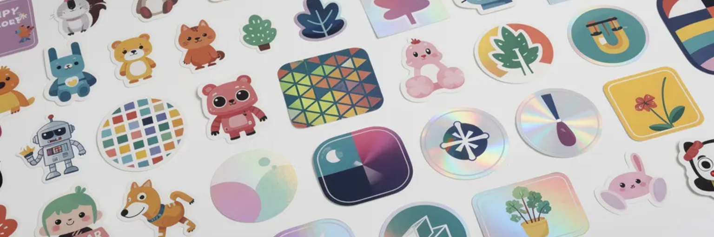
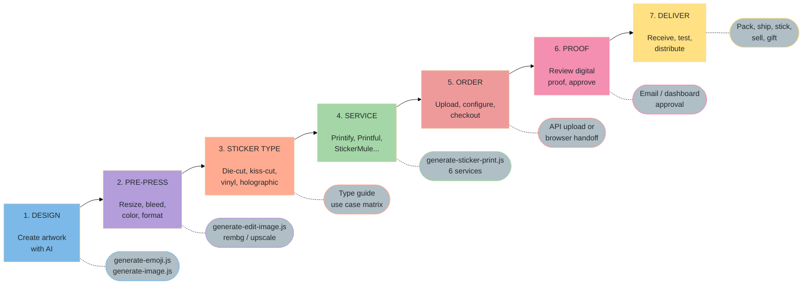
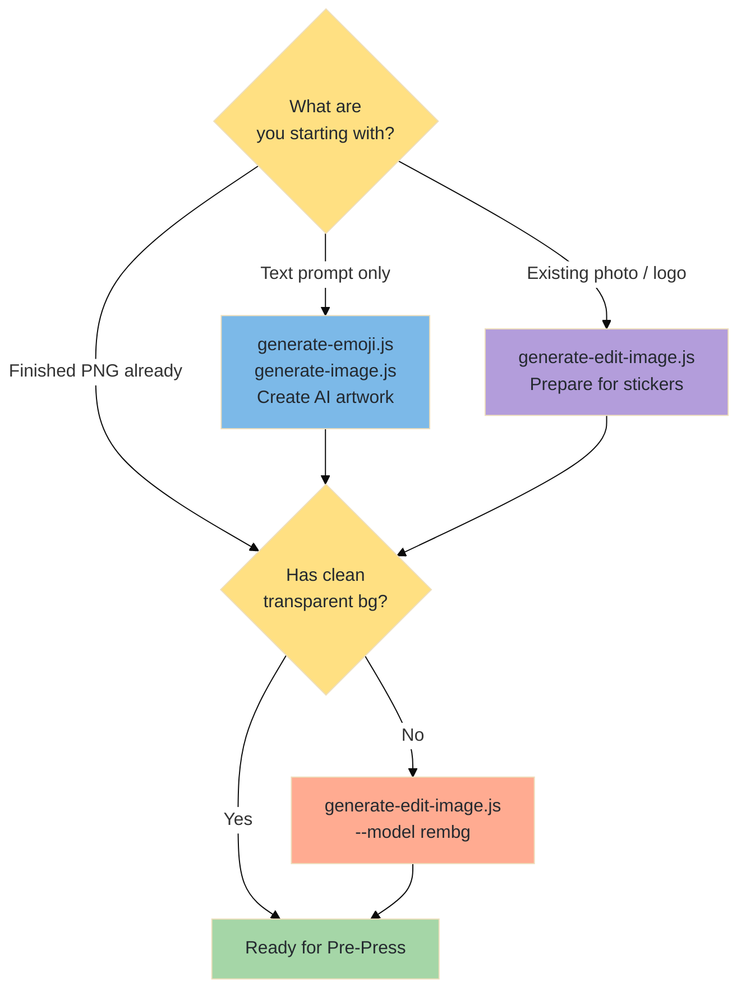
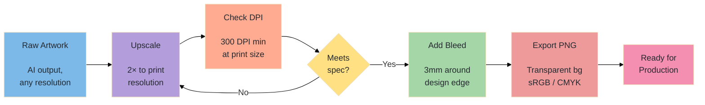
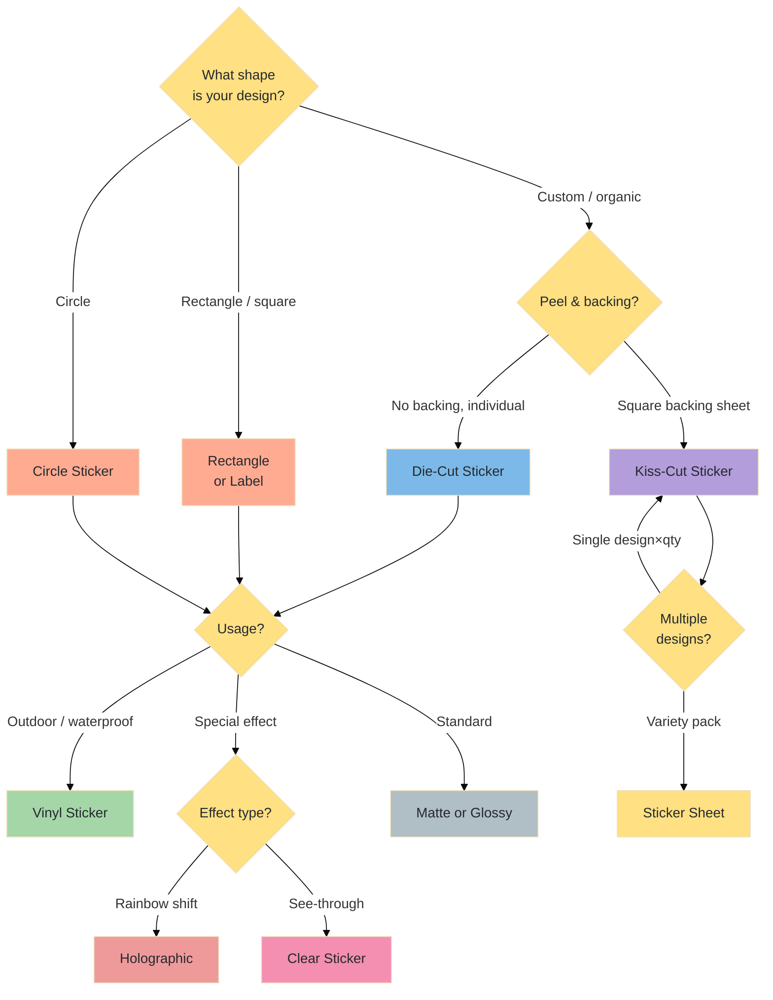
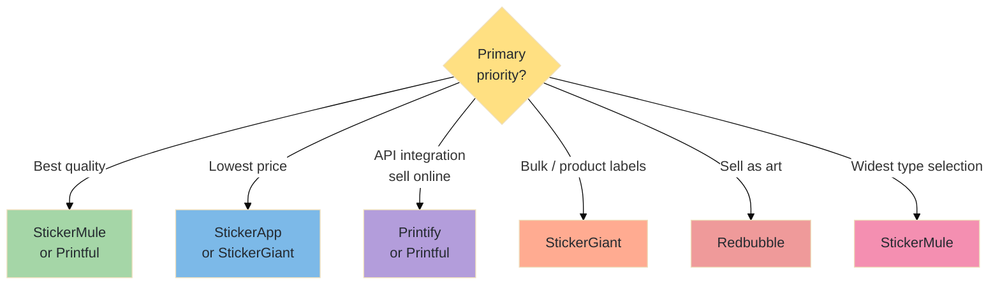
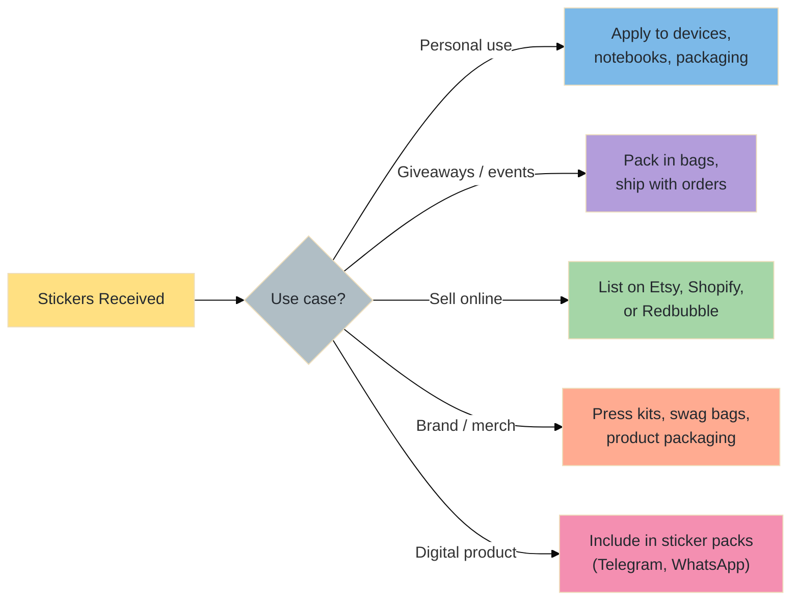

# From Design to Doorstep — The Complete Sticker & Print Production Workflow

A step-by-step manual covering the full pipeline: concept → AI artwork → pre-press prep → service selection → ordering → proof → delivery. Uses the AlexVideos CLI toolkit throughout.

---

## Table of Contents

1. [Workflow Overview](#workflow-overview)
2. [Phase 1 — Artwork Design](#phase-1--artwork-design)
3. [Phase 2 — Pre-Press Preparation](#phase-2--pre-press-preparation)
4. [Phase 3 — Sticker Type Selection](#phase-3--sticker-type-selection)
5. [Phase 4 — Service Selection](#phase-4--service-selection)
6. [Phase 5 — Ordering](#phase-5--ordering)
7. [Phase 6 — Proof & Production](#phase-6--proof--production)
8. [Phase 7 — Distribution & Use](#phase-7--distribution--use)
9. [End-to-End Pipeline Examples](#end-to-end-pipeline-examples)
10. [Troubleshooting](#troubleshooting)
11. [Service Comparison Guide](#service-comparison-guide)

---

## Workflow Overview



---

## Phase 1 — Artwork Design

The most critical step. Bad artwork cannot be fixed in production.



### 1a. Generate Emoji-Style Stickers

Emoji and cartoon-style stickers are ideal — bold outlines, simple shapes, vibrant colors that print well.

```bash
# Cartoon character sticker
node generate-emoji.js "happy robot with thumbs up, bold outline, white background" --model sdxlemoji --width 512 --height 512

# Cute animal sticker
node generate-emoji.js "smiling shiba inu, sticker style, thick black outline, white background" --model platmoji

# Custom character from a photo (photo-to-emoji)
node generate-emoji.js "make this a cute cartoon emoji sticker, white background" --model kontextemoji --image ./photo.jpg
```

### 1b. Generate Illustration-Style Stickers

For more detailed or realistic sticker artwork:

```bash
# Product / brand sticker
node generate-image.js "minimalist coffee cup sticker design, flat illustration, white background, vector style" --model flux2pro

# Character sticker sheet design
node generate-image.js "cute space explorer character in 6 poses: waving, jumping, sleeping, eating, reading, running — sticker sheet layout, white background" --model nanapro

# Logo adaptation
node generate-image.js "convert this logo into a sticker design with bold outline and drop shadow" --model kontext --image ./logo.png
```

### 1c. Background Removal

Die-cut, kiss-cut, and clear stickers require a transparent background.

```bash
# Remove background from AI-generated artwork
node generate-edit-image.js --model rembg --image ./media/*sdxlemoji*.png

# Clean up edges after removal
node generate-edit-image.js "clean up rough edges, smooth the outline" --model kontext --image ./media/*rembg*.png
```

### Artwork Design Principles

| Principle | Guideline | Why |
|-----------|-----------|-----|
| **Bold outlines** | 2–4 px outline at print size | Thin lines vanish in production |
| **Simple shapes** | Avoid tiny details under 2mm | Small details blur at sticker scale |
| **Solid fills** | Flat colors over gradients | Gradients can band or bleed |
| **White background** | Keep if not die-cut | Required for rectangular/sheet stickers |
| **Transparent background** | Required for die-cut/clear | Defines the sticker shape |
| **Consistent style** | Use same model + seed across a set | Pack looks cohesive |

---

## Phase 2 — Pre-Press Preparation

Artwork that looks great on screen may print badly. Pre-press transforms a digital design into a production-ready file.



### 2a. Resolution Requirements

| Print Size | Minimum Resolution at 300 DPI |
|------------|-------------------------------|
| 1" × 1" | 300 × 300 px |
| 2" × 2" | 600 × 600 px |
| 3" × 3" | 900 × 900 px |
| 4" × 4" | 1200 × 1200 px |
| 5" × 5" | 1500 × 1500 px |
| A5 sheet (5.8" × 8.3") | 1740 × 2490 px |

AI-generated images are typically 512–1024 px. Always upscale before ordering:

```bash
# Upscale 512px emoji to print resolution (4× → 2048px)
node generate-edit-image.js --model upscale --image ./media/*rembg*.png

# 2× upscale for large prints
node generate-edit-image.js --model upscale --image ./design.png --scale 2
```

### 2b. DPI and Size Check (FFmpeg / ImageMagick)

```bash
# Check current dimensions and effective DPI
ffprobe -v quiet -print_format json -show_streams ./media/*rembg*.png | findstr "width\|height"

# With ImageMagick
magick identify -verbose ./media/*rembg*.png | findstr "Geometry\|Resolution\|Print"

# Resize to specific print dimension at 300 DPI
magick convert ./media/*rembg*.png -units PixelsPerInch -density 300 -resize 900x900 ./print-ready.png
```

### 2c. Adding Bleed

A 3mm bleed (≈35px at 300 DPI) prevents white edges if the cut line shifts slightly.

```bash
# Add 35px bleed border (transparent — die-cut/clear stickers)
magick convert ./design.png -bordercolor none -border 35 ./design-bleed.png

# Add white bleed border (rectangular/sheet stickers)
magick convert ./design.png -bordercolor white -border 35 ./design-bleed-white.png
```

### 2d. Safe Zone

Keep all important content 1/16" (about 18px at 300 DPI) inside the cut line.

```
┌─────────────────────────────┐
│░░░░░ BLEED (3mm/35px) ░░░░░│
│  ┌───────────────────────┐  │
│  │▒▒ SAFE ZONE (1/16")▒▒│  │
│  │  ┌─────────────────┐  │  │
│  │  │                 │  │  │
│  │  │   DESIGN AREA   │  │  │
│  │  │                 │  │  │
│  │  └─────────────────┘  │  │
│  └───────────────────────┘  │
└─────────────────────────────┘
```

### 2e. Pre-Press Checklist

- [ ] Resolution ≥ 300 DPI at intended print size
- [ ] PNG format with alpha channel (transparency)
- [ ] Background removed (for die-cut / clear)
- [ ] 3mm bleed added
- [ ] Important elements inside safe zone
- [ ] File size under 25 MB for API uploads
- [ ] sRGB color profile (CMYK if service specifies)
- [ ] No thin lines under 0.3mm at print size

---

## Phase 3 — Sticker Type Selection



### Sticker Type Reference

| Type | Cut Style | Backing | Best For | Min DPI | Transparency |
|------|-----------|---------|----------|---------|--------------|
| **Die-cut** | Custom shape | None (individual) | Logos, characters, merchandise | 300 | Required (PNG) |
| **Kiss-cut** | Custom shape | Square sheet | Sticker packs, giveaways, easy peel | 300 | Required (PNG) |
| **Vinyl** | Custom or rectangle | None | Outdoor, laptops, water bottles | 300 | Optional |
| **Holographic** | Custom or rectangle | None | Collectibles, premium merch | 300 | Not applicable |
| **Clear** | Custom shape | None | Glass, bottles, transparent surfaces | 300 | Required (PNG) |
| **Sticker sheet** | Sheet boundary | None | Variety packs, samplers | 300 | Optional per design |
| **Bumper** | Rectangle | None | Vehicles, large surfaces | 150 | Not applicable |

### Die-Cut vs Kiss-Cut

```
Die-cut:                    Kiss-cut:
 ╭──────╮                   ┌────────────┐
╱ ★ STAR ╲                  │  ╭──────╮  │
╲         ╱                 │ ╱ ★ STAR ╲ │
 ╰────────╯                 │ ╲        ╱ │
                            │  ╰───────╯ │
No backing.                 └────────────┘
Each sticker has            Square backing — easier
its own cut shape.          to peel, good for sheets.
```

---

## Phase 4 — Service Selection



### Service Comparison

| Service | Type | Integration | Sticker Types | Min Qty | Notable |
|---------|------|-------------|---------------|---------|---------|
| **Printify** | Print-on-demand | Full API | Die-cut, kiss-cut, sheets, labels | 1 | 100+ print providers, sell in your store |
| **Printful** | Print-on-demand | Full API | Stickers, kiss-cut, labels | 1 | Premium quality, global fulfillment |
| **StickerMule** | On-demand print | Browser | Die-cut, kiss-cut, bumper, holographic, clear, circle, rectangle, sheet | 10 | Industry-best quality, free shipping, fast |
| **StickerApp** | On-demand print | Browser | Die-cut, kiss-cut, vinyl, holographic, clear, sheet | 25 | Online design tool, competitive pricing |
| **StickerGiant** | Professional print | Browser | Die-cut, kiss-cut, vinyl, bumper, clear | 250 | Product labels, bulk orders, exact rolls |
| **Redbubble** | Marketplace | Browser | All types (platform handles production) | 1 | Sell your designs; passive income |

### Decision Matrix

| Scenario | Recommended Service |
|----------|---------------------|
| Personal stickers, highest quality | StickerMule |
| Sticker pack for giveaways (small qty) | StickerMule or StickerApp |
| Sell stickers in your Shopify/Etsy store | Printify or Printful (API fulfillment) |
| Product labels for retail packaging | StickerGiant |
| Holographic or special finishes | StickerMule |
| Artist selling designs online | Redbubble |
| API automation, hands-off fulfillment | Printify |
| Budget bulk order (250+) | StickerGiant |

---

## Phase 5 — Ordering

### 5a. API-Based Ordering (Printify / Printful)

Set up tokens in `.env`:

```
PRINTIFY_API_TOKEN=your_printify_token
PRINTFUL_API_TOKEN=your_printful_token
```

Get them from:
- Printify: [printify.com/app/account/api](https://printify.com/app/account/api)
- Printful: [printful.com/dashboard/developer](https://www.printful.com/dashboard/developer)

```bash
# Upload artwork and browse sticker catalog (Printify)
node generate-sticker-print.js --file ./print-ready.png --service printify

# List all available sticker products
node generate-sticker-print.js --list --service printify
node generate-sticker-print.js --list --service printful

# Upload to Printful
node generate-sticker-print.js --file ./print-ready.png --service printful
```

### 5b. Browser-Based Ordering

```bash
# Open all services at once
node generate-sticker-print.js --file ./print-ready.png --service all

# Open specific service with sticker type pre-selected
node generate-sticker-print.js --file ./print-ready.png --service stickermule --type die-cut
node generate-sticker-print.js --file ./print-ready.png --service stickerapp --type kiss-cut
node generate-sticker-print.js --file ./print-ready.png --service stickergiant --type vinyl
node generate-sticker-print.js --file ./print-ready.png --service redbubble

# Open with additional options
node generate-sticker-print.js --file ./print-ready.png --service stickermule --type holographic --quantity 50 --size 3x3
```

### 5c. Ordering Configuration

| Parameter | Die-cut | Kiss-cut | Vinyl | Sheet | Bumper |
|-----------|---------|----------|-------|-------|--------|
| **Size** | 2–5" common | 2–5" common | 2–8" | A4/A5 | 11.5×3" standard |
| **Finish** | Matte or glossy | Matte or glossy | Matte or glossy | Matte or glossy | Glossy |
| **Min qty** | 10–25 | 10–25 | 10–25 | 1 sheet | 10–25 |
| **Economy qty** | 50–100 | 50–100 | 25–50 | 5–10 | 25–50 |
| **Unit cost drops at** | 50, 100, 250 | 50, 100, 250 | 50, 100 | 10, 25 | 50, 100 |

### 5d. Pricing Estimate (approximate)

| Qty | Die-cut 3×3" | Vinyl | Holographic | Sheet (A5) |
|-----|-------------|-------|-------------|------------|
| 10 | ~$1.40 ea | ~$1.50 ea | ~$2.50 ea | ~$5.00 ea |
| 25 | ~$1.00 ea | ~$1.10 ea | ~$1.80 ea | ~$3.50 ea |
| 50 | ~$0.80 ea | ~$0.90 ea | ~$1.40 ea | ~$3.00 ea |
| 100 | ~$0.60 ea | ~$0.70 ea | ~$1.10 ea | ~$2.50 ea |
| 250 | ~$0.40 ea | ~$0.50 ea | ~$0.80 ea | ~$2.00 ea |

> Prices vary by service and change frequently. Always check current pricing on the service website.

---

## Phase 6 — Proof & Production

### 6a. Digital Proof Review

Most services provide a **digital proof** (preview image) before production begins. Always review it carefully.

**What to check:**
- [ ] Design is centered and not clipped
- [ ] Cut line follows the shape you expect
- [ ] No white halos or fringing around die-cut edges
- [ ] Text is readable (if any)
- [ ] Colors look accurate (allow for slight screen vs. print variance)
- [ ] Bleed extends naturally with no harsh border
- [ ] Safe zone content clearly inside the cut boundary

**StickerMule** generates a proof automatically and emails it. You must approve it before production starts.

**Printify/Printful** show a preview in their dashboard when you create a product. Review before publishing to your store or ordering.

### 6b. Production Timelines

| Service | Standard Turnaround | Rush Available |
|---------|--------------------|--------------  |
| StickerMule | 4 business days | Yes (+ fee) |
| StickerApp | 3–7 business days | Varies |
| StickerGiant | 3–5 business days | Yes |
| Printify | Depends on print provider (3–7 days) | Provider-dependent |
| Printful | 2–5 business days | Yes (+ fee) |

> Turnaround = production only. Add shipping time (domestic usually 3–5 days; international 7–21 days).

### 6c. Requesting Changes

If the proof has issues:

| Issue | How to Fix |
|-------|-----------|
| Cut line wrong | Re-upload with corrected bleed/transparent area |
| Design too small | Increase canvas size, re-upload |
| Halo/white fringe | Tighten `rembg` mask: `node generate-edit-image.js "clean up edges" --model kontext` |
| Color looks off | This is normal — request a physical sample first before large orders |
| Text cropped | Move text inward to safe zone; `kontext` model can reposition elements |

---

## Phase 7 — Distribution & Use

### 7a. Use Case Paths



### 7b. Selling Stickers

**Online marketplaces:**
- **Etsy** — Upload product photos, set prices, handle shipping. Great for handmade/indie feel.
- **Shopify** — Use Printify/Printful API to auto-fulfill orders without holding inventory.
- **Redbubble** — Upload once; Redbubble prints and ships. You earn a % per sale.
- **Gumroad** — Sell digital + physical; good for sticker packs with digital versions included.

**Pricing for retail:**
| Cost | Markup | Retail Price |
|------|--------|-------------|
| $0.40 ea (bulk) | 5× | $2.00 ea |
| $0.80 ea (medium) | 3× | $2.50 ea |
| $1.40 ea (small run) | 2× | $3.00 ea |
| Sheet $3.00 | 2× | $6.00 ea |

A typical 3×3" die-cut sticker on Etsy retails for $2–$4 single or $8–$15 for a 5-pack.

### 7c. Sticker Longevity & Application Tips

| Surface | Prep | Longevity |
|---------|------|-----------|
| Laptop lid | Clean with alcohol wipe | 2–4 years |
| Water bottle | Clean, dry, apply firmly | 1–3 years (dishwasher-safe vinyl) |
| Car bumper | Clean surface, apply in warm temp | 3–5 years (outdoor vinyl) |
| Skateboard | Rough surface OK for vinyl | 6–18 months |
| Notebook | Paper surface | Permanent |
| Window / glass | Clean glass, apply from one side | 1–3 years |

**Application tips:**
- Apply at room temperature (not cold — adhesive weakens below 50°F)
- Clean surface with isopropyl alcohol, let dry fully before applying
- Squeegee from center outward to remove air bubbles
- For clear stickers: avoid air bubbles, they show more than on opaque

---

## End-to-End Pipeline Examples

### Example 1 — Emoji Character Sticker Pack (Die-Cut, 50 qty)

```bash
# 1. Generate 4 emotions with consistent seed
CHAR="cute round cat with big eyes"
node generate-emoji.js "$CHAR happy, white background" --seed 7 --model sdxlemoji --width 512 --height 512
node generate-emoji.js "$CHAR sad, white background" --seed 7 --model sdxlemoji --width 512 --height 512
node generate-emoji.js "$CHAR surprised, white background" --seed 7 --model sdxlemoji --width 512 --height 512
node generate-emoji.js "$CHAR laughing, white background" --seed 7 --model sdxlemoji --width 512 --height 512

# 2. Remove backgrounds
Get-ChildItem ./media/*sdxlemoji*.png | ForEach-Object {
    node generate-edit-image.js --model rembg --image $_.FullName
}

# 3. Upscale to print resolution
Get-ChildItem ./media/*rembg*.png | ForEach-Object {
    node generate-edit-image.js --model upscale --image $_.FullName
}

# 4. Order die-cut stickers from StickerMule
node generate-sticker-print.js --file ./media/*upscale*happy*.png --service stickermule --type die-cut --size 3x3 --quantity 50
```

---

### Example 2 — Vinyl Sticker for Laptops / Outdoors

```bash
# 1. Generate bold logo/icon design
node generate-image.js "minimalist geometric mountain logo, flat vector, white background, bold shapes" --model flux2pro --width 1024 --height 1024

# 2. Remove background
node generate-edit-image.js --model rembg --image ./media/*flux2pro*.png

# 3. Upscale for 4" × 4" print (at 300 DPI needs 1200px)
node generate-edit-image.js --model upscale --image ./media/*rembg*.png

# 4. Order vinyl stickers
node generate-sticker-print.js --file ./media/*upscale*.png --service stickerapp --type vinyl --size 4x4 --quantity 100
```

---

### Example 3 — Holographic Collectible Sticker

```bash
# 1. Generate vibrant character design
node generate-image.js "anime-style dragon character, vibrant neon colors, black background, glowing effect" --model nanapro --width 512 --height 512

# 2. Prepare for print
node generate-edit-image.js --model rembg --image ./media/*nanapro*.png
node generate-edit-image.js --model upscale --image ./media/*rembg*.png

# 3. Order holographic stickers (StickerMule is best for this)
node generate-sticker-print.js --file ./media/*upscale*.png --service stickermule --type holographic --size 3x3 --quantity 50
```

---

### Example 4 — Sticker Sheet (Pack of 10 Designs)

```bash
# 1. Generate a set of themed stickers
theme="space exploration emoji"
for emotion in "rocket launch" "astronaut waving" "alien hello" "moon with face" "planet earth" "star sparkle" "comet" "ufo" "telescope" "space suit"
do
    node generate-emoji.js "$theme - $emotion, white background" --model sdxlemoji
done

# 2. Remove all backgrounds
Get-ChildItem ./media/*sdxlemoji*.png | ForEach-Object {
    node generate-edit-image.js --model rembg --image $_.FullName
}

# 3. Combine into a sticker sheet (use image editor or upload individually)
# StickerApp lets you upload 6-10 designs to a sheet in their online editor

# 4. Order the sheet
node generate-sticker-print.js --file ./media/*rembg*rocket*.png --service stickerapp --type sheet
```

---

### Example 5 — Print-on-Demand Store (Printify API)

```bash
# Set up .env
# PRINTIFY_API_TOKEN=your_token

# 1. Upload artwork to Printify
node generate-sticker-print.js --file ./sticker.png --service printify

# 2. Browse available sticker blueprints
node generate-sticker-print.js --list --service printify

# 3. Complete product setup in Printify dashboard
# → printify.com/app/editor
# Select blueprint, configure print area, set variants, publish to Etsy/Shopify
```

---

## Troubleshooting

### Artwork Issues

| Problem | Cause | Solution |
|---------|-------|----------|
| White halo around die-cut | rembg left soft edges | Run kontext: `"clean up rough edges around the character"` |
| Colors look washed out in print | RGB only; no print compensation | Order a sample first; tweak saturation +10% in editor |
| Sticker looks blurry | Resolution too low | Upscale before ordering; minimum 300 DPI at print size |
| Design is pixelated | Upscaled too aggressively | Generate at higher resolution initially; upscale is 2× not 4× |
| Cut line cuts into design | No bleed or wrong transparent area | Re-add 3mm bleed; check transparent px boundary |
| Small details vanished | Detail too fine for sticker scale | Bold up lines, remove sub-1mm elements |

### Ordering Issues

| Problem | Cause | Solution |
|---------|-------|----------|
| API upload rejected | File too large or wrong format | Max 25 MB for API; use PNG not WebP |
| Printify token invalid | Token expired or wrong env var | Regenerate token at printify.com/app/account/api |
| Browser doesn't open | `open` package issue | Copy the printed URL and open manually |
| Proof shows wrong shape | Wrong transparent area | Die-cut shape = what's opaque in your PNG |
| Type URL not opening | Service URL changed | Check service website directly; update script if needed |

### Print Quality Issues

| Problem | Cause | Solution |
|---------|-------|----------|
| Color banding in gradients | Gradient compressed to banding | Convert gradients to flat colors or ordered dithering |
| Ink bleeding outside lines | Too much ink saturation | Reduce total ink density; avoid 100% black + all channels |
| Sticker won't stick | Surface not clean | Wipe surface with isopropyl; let dry 30s before applying |
| Bubbles under clear sticker | Air trapped during application | Start from center, squeegee out; or peel and reapply |

---

## Service Comparison Guide

### Full Comparison

| Feature | Printify | Printful | StickerMule | StickerApp | StickerGiant | Redbubble |
|---------|----------|----------|-------------|------------|--------------|-----------|
| **API Integration** | ✅ Full | ✅ Full | ❌ | ❌ | ❌ | ❌ |
| **Die-cut** | ✅ | ✅ | ✅ | ✅ | ✅ | ✅ |
| **Kiss-cut** | ✅ | ✅ | ✅ | ✅ | ✅ | ✅ |
| **Vinyl** | ✅ | ✅ | ✅ | ✅ | ✅ | ✅ |
| **Holographic** | Varies | Varies | ✅ | ✅ | ❌ | Varies |
| **Clear** | Varies | Varies | ✅ | ✅ | ✅ | Varies |
| **Sticker sheets** | ✅ | ✅ | ✅ | ✅ | ✅ | ✅ |
| **Min qty** | 1 | 1 | 10 | 25 | 250 | 1 |
| **Global shipping** | ✅ | ✅ | ✅ | ✅ | ✅ | ✅ |
| **Drop shipping** | ✅ | ✅ | ❌ | ❌ | ❌ | ✅ |
| **White-label** | ✅ | ✅ | ❌ | ❌ | ❌ | ❌ |
| **Free design tool** | ❌ | ❌ | ✅ | ✅ | ✅ | ✅ |

### When to Use Which

| Goal | Best Service | Why |
|------|-------------|-----|
| Best print quality, personal orders | **StickerMule** | Industry leader, free shipping, 4-day turnaround |
| Sell stickers automatically | **Printify** or **Printful** | API-driven fulfillment, integrates with Shopify/Etsy |
| Budget order, medium qty | **StickerApp** | Competitive pricing, solid quality, variety of types |
| Product labels, packaging | **StickerGiant** | Roll labels, specialty cuts, bulk pricing |
| List designs for sale without inventory | **Redbubble** | Zero upfront cost; Redbubble handles everything |
| Waterproof outdoor stickers | **StickerApp** or **StickerMule** | Vinyl options, UV laminate |
| Holographic / special effects | **StickerMule** | Widest special finish selection |

---

*See also: [generate-sticker-print.md](generate-sticker-print.md) · [emoji-sticker-workflow.md](emoji-sticker-workflow.md) · [generate-emoji.md](generate-emoji.md) · [generate-edit-image.md](generate-edit-image.md)*
