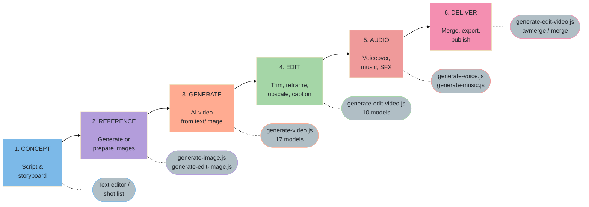
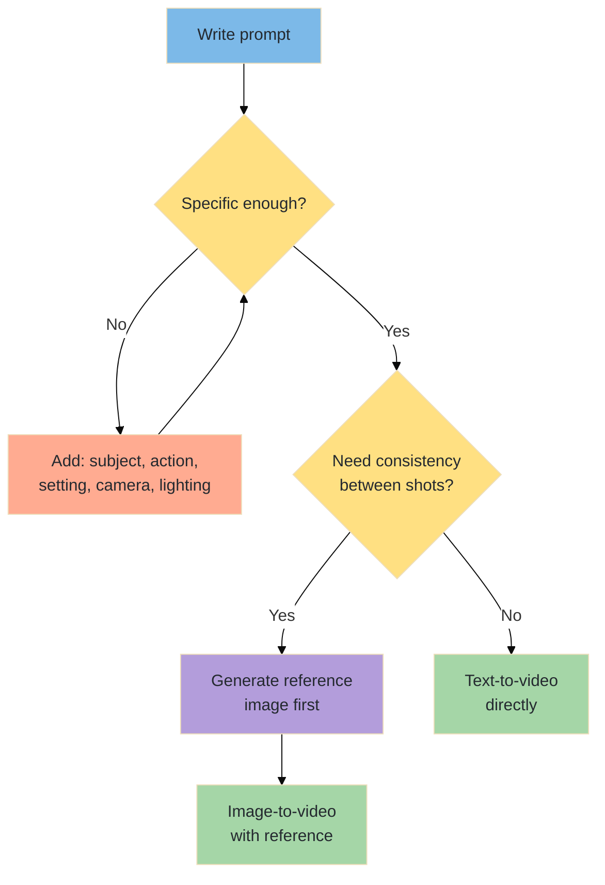
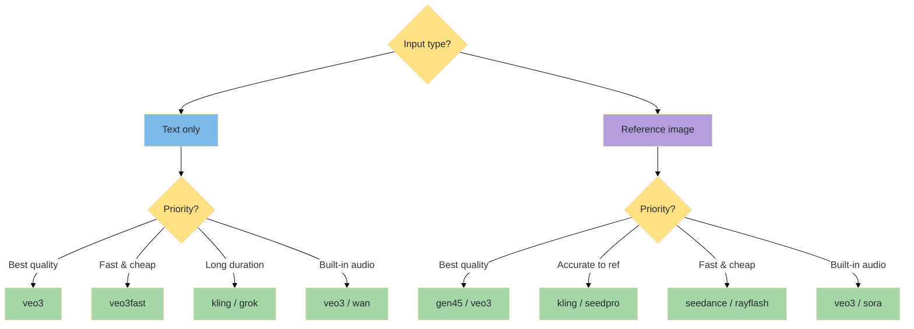
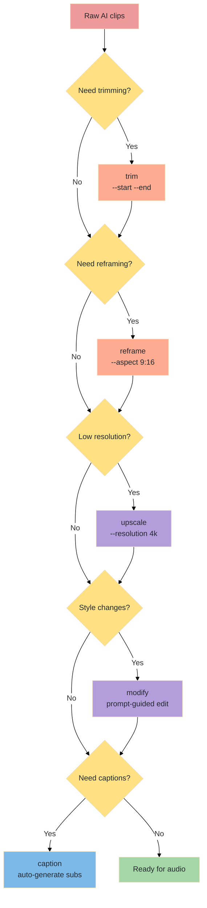
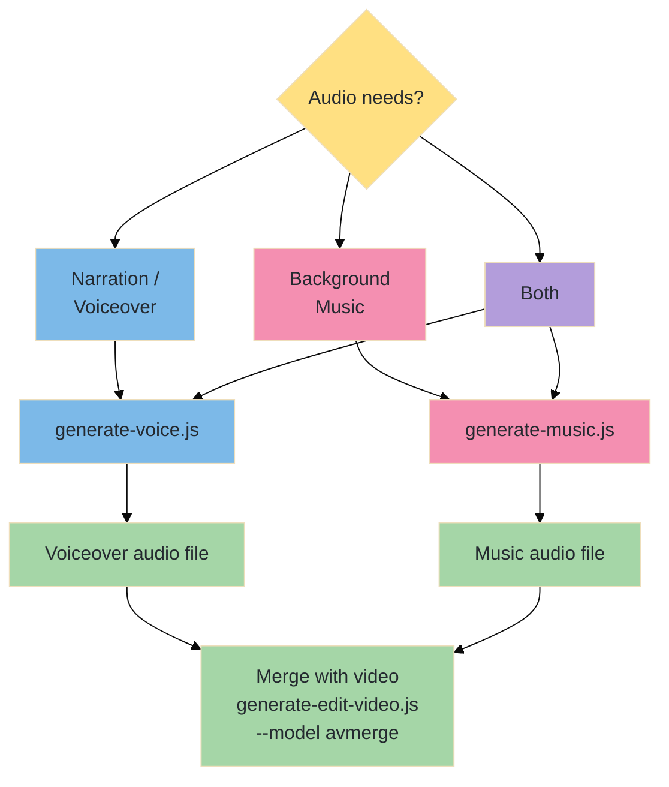

# From Script to Screen — The Complete Video Production Workflow

A step-by-step manual covering the full pipeline: concept → reference image → AI video → edit & enhance → soundtrack → final delivery. Uses the AlexVideos CLI toolkit throughout.

---

## Table of Contents

1. [Workflow Overview](#workflow-overview)
2. [Phase 1 — Concept & Storyboard](#phase-1--concept--storyboard)
3. [Phase 2 — Reference Images](#phase-2--reference-images)
4. [Phase 3 — AI Video Generation](#phase-3--ai-video-generation)
5. [Phase 4 — Video Editing & Enhancement](#phase-4--video-editing--enhancement)
6. [Phase 5 — Audio & Soundtrack](#phase-5--audio--soundtrack)
7. [Phase 6 — Final Assembly & Delivery](#phase-6--final-assembly--delivery)
8. [End-to-End Pipeline Examples](#end-to-end-pipeline-examples)
9. [Troubleshooting](#troubleshooting)
10. [Model Selection Guide](#model-selection-guide)

---

## Workflow Overview



---

## Phase 1 — Concept & Storyboard

Before generating anything, plan what you're making. Even a simple shot list dramatically improves results.

### 1a. Define Your Project

| Question | Example Answers |
|----------|----------------|
| **What is the video for?** | Social media reel, product demo, music video, short film |
| **Target duration?** | 15s (reel), 30s (ad), 60s (explainer), 3–5 min (short) |
| **Aspect ratio?** | 16:9 (YouTube), 9:16 (TikTok/Reels), 1:1 (Instagram) |
| **Style / mood?** | Cinematic, animated, documentary, surreal, corporate |
| **Has dialogue?** | Yes → plan voiceover in Phase 5 |
| **Has music?** | Yes → plan soundtrack in Phase 5 |

### 1b. Create a Shot List

A shot list maps each scene to a generation approach:

| Shot | Duration | Description | Approach |
|------|----------|-------------|----------|
| 1 | 5s | Wide establishing shot of city at sunset | Text-to-video (Veo 3.1) |
| 2 | 4s | Close-up of character walking | Image-to-video (reference photo) |
| 3 | 6s | Product reveal with dramatic lighting | Image-to-video (product photo) |
| 4 | 5s | Logo animation / outro | Text-to-video + caption overlay |

### 1c. Prompt Engineering Tips



**Good prompts include:**
- **Subject**: Who or what is in frame
- **Action**: What's happening (camera and subject movement)
- **Setting**: Where it takes place
- **Camera**: POV, angle, movement (dolly, pan, tracking shot, aerial)
- **Lighting**: Golden hour, neon, studio, natural, dramatic shadows
- **Style**: Cinematic, anime, documentary, film grain, slow motion

| Weak Prompt | Strong Prompt |
|------------|---------------|
| "a dog running" | "Golden retriever running through shallow ocean waves at sunset, tracking shot, slow motion, cinematic, warm golden light" |
| "city at night" | "Aerial dolly shot over Tokyo at night, neon signs reflecting in wet streets, slight rain, cyberpunk atmosphere, 4K" |

---

## Phase 2 — Reference Images

For consistent, controllable video, generate a reference image first and use image-to-video.

### 2a. Generate Reference Frames

```bash
# Product shot — clean background for video generation
node generate-image.js "sleek wireless earbuds on white marble surface, studio lighting, product photo" --model imagen4

# Character reference — will become first frame of video
node generate-image.js "young woman in leather jacket standing on rooftop at dusk, cinematic portrait" --model nanapro

# Scene background — establishing shot reference
node generate-image.js "aerial view of mountain lake at golden hour, cinematic landscape, 16:9" --model flux2pro --aspect 16:9
```

### 2b. Clean Up References

```bash
# Remove busy background
node generate-edit-image.js --model rembg --image ./media/product-shot.png

# Replace background with something specific
node generate-edit-image.js "futuristic lab background with holographic displays" --model bggen --image ./media/portrait.png

# Upscale for higher-quality video input
node generate-edit-image.js --model upscale --image ./media/landscape.png --scale 2

# Edit details before animating
node generate-edit-image.js "add motion blur to the hair" --model kontext --image ./media/portrait.png
```

### 2c. Reference Image Best Practices

| Guideline | Why |
|-----------|-----|
| **Match target aspect ratio** | 16:9 reference → 16:9 video avoids cropping artifacts |
| **Avoid text in reference images** | AI video models distort text during animation |
| **Single subject, clear composition** | Complex scenes produce unpredictable motion |
| **Good lighting, high contrast** | AI preserves lighting from the reference frame |
| **Static / stable pose** | The model decides what moves — give it a clear starting point |
| **Resolution ≥ 1024px** | Higher input quality = better video output |

---

## Phase 3 — AI Video Generation



### 3a. Text-to-Video

```bash
# Best quality — Veo 3.1 (includes audio)
node generate-video.js "Golden retriever running through ocean waves at sunset, tracking shot, slow motion, cinematic" --model veo3 --duration 8

# Fast draft — Veo 3.1 Fast
node generate-video.js "Golden retriever running through ocean waves at sunset" --model veo3fast --duration 6

# Budget option — WAN 2.5
node generate-video.js "Golden retriever running on beach at sunset, cinematic" --model wan --duration 5

# Vertical for social media
node generate-video.js "Person dancing in neon-lit alley, TikTok style" --model veo3fast --aspect 9:16 --duration 6
```

### 3b. Image-to-Video

Using a reference image as the starting frame gives you consistency:

```bash
# Veo 3.1 — animate a product shot
node generate-video.js "camera slowly orbits around the product, dramatic lighting" --model veo3 --image ./media/product.png --duration 6

# Gen-4.5 (Runway) — character animation
node generate-video.js "she turns and walks toward camera, wind in hair" --model gen45 --image ./media/portrait.png --duration 8

# Kling v3 — precise motion control
node generate-video.js "camera pulls back slowly to reveal the landscape" --model kling --image ./media/landscape.png --duration 10

# Seedance Pro — 1080p output
node generate-video.js "gentle parallax zoom, clouds moving slowly" --model seedpro --image ./media/scene.png --duration 8
```

### 3c. Model Selection Quick Reference

| Goal | Model | Cost | Duration | Audio |
|------|-------|------|----------|-------|
| **Best overall quality** | `veo3` | $0.20–$0.40/s | 4/6/8s | Auto |
| **Fast iteration** | `veo3fast` | $0.10–$0.15/s | 4/6/8s | Auto |
| **Cheapest** | `seedance` | $0.036/s | 2–12s | No |
| **Longest clips** | `kling` / `grok` | $0.05–$0.22/s | 3–15s | Optional |
| **Best image-to-video** | `gen45` / `kling` | $0.12–$0.22/s | 5–10s | No |
| **Built-in audio** | `veo3` / `sora` / `wan` | varies | varies | Auto |
| **1080p output** | `seedpro` / `sora2pro` | $0.15–$0.50/s | 2–12s | Varies |

### 3d. Generation Best Practices

| Practice | Detail |
|----------|--------|
| **Generate multiple takes** | Run the same prompt 3–5 times; AI output varies significantly |
| **Start short, refine long** | Generate 4s clips first to test; extend duration once happy |
| **Use negative prompts** | `--negative "blurry, distorted, text"` on models that support it |
| **Match aspect ratio** | Choose 16:9 / 9:16 / 1:1 based on final delivery platform |
| **Keep prompts under 200 words** | Overly long prompts confuse most models |
| **Describe camera movement** | "Dolly in", "tracking shot", "crane shot" give better results than "camera moves" |

---

## Phase 4 — Video Editing & Enhancement



### 4a. Trim & Cut

```bash
# Keep only the best 5 seconds from a longer clip
node generate-edit-video.js --model trim --video ./media/clip.mp4 --start 2 --end 7

# Extract first frame as a thumbnail
node generate-edit-video.js --model frames --video ./media/clip.mp4 --first-frame
```

### 4b. Reframe for Different Platforms

```bash
# Convert 16:9 to 9:16 for TikTok/Reels (AI-powered smart crop)
node generate-edit-video.js --model reframe --video ./media/clip.mp4 --aspect 9:16

# Convert to 1:1 for Instagram
node generate-edit-video.js --model reframe --video ./media/clip.mp4 --aspect 1:1
```

### 4c. Upscale & Enhance

```bash
# AI upscale to 4K
node generate-edit-video.js --model upscale --video ./media/clip.mp4 --resolution 4k

# AI style modification
node generate-edit-video.js "make it look like a 1970s film with warm grain" --model modify --video ./media/clip.mp4
```

### 4d. Add Captions

```bash
# Auto-generate burned-in subtitles
node generate-edit-video.js --model caption --video ./media/clip.mp4
```

### 4e. Editing Tips

| Tip | Detail |
|-----|--------|
| **Trim before upscaling** | Upscaling is expensive — only upscale the final cut |
| **Reframe with Luma** | AI reframe tracks subjects better than blind center-crop |
| **Style-modify sparingly** | Heavy style changes degrade detail; subtle adjustments work best |
| **Extract thumbnail** | Use `--model frames --first-frame` for social media thumbnails |
| **Batch process takes** | Trim all your clips first, then select the best before upscaling |

---

## Phase 5 — Audio & Soundtrack

Most AI videos benefit from professional audio: narration, music, or both.



### 5a. Generate Voiceover

```bash
# Professional narration — MiniMax HD
node generate-voice.js "Welcome to our product showcase. This revolutionary device changes everything." --model mm28hd --voice English_Female_1

# Emotional delivery
node generate-voice.js "And in that moment, everything changed." --model mm28turbo --emotion happy --speed 0.9

# Clone a specific voice
node generate-voice.js --model mmclone --audio ./my-voice-sample.mp3
# Then use the cloned voice_id in subsequent generations

# Multilingual narration
node generate-voice.js "Bienvenue dans notre démonstration" --model chatmlang --audio ./french-reference.mp3
```

### 5b. Generate Soundtrack

```bash
# Background music — match the mood
node generate-music.js "cinematic ambient soundtrack, hopeful, inspiring, no vocals" --model stableaudio --duration 30

# Upbeat social media music
node generate-music.js "upbeat electronic pop, energetic, modern" --model music15

# Full song with lyrics for music video
node generate-music.js "indie rock ballad" --model music15 --lyrics "[verse]\nWalking down the road\nSearching for a sign\n[chorus]\nWe'll find our way home"

# Short jingle
node generate-music.js "happy corporate jingle, 10 seconds" --model stableaudio --duration 10
```

### 5c. Audio Mixing Tips

| Tip | Detail |
|-----|--------|
| **Voiceover first, music second** | Voice should be clear; music is supporting |
| **Music volume** | Background music should be -12 to -18 dB below voice |
| **Match duration** | Generate music matching your video length — use `--duration` |
| **Avoid auto-audio conflicts** | If your video model generated audio (Veo 3.1), extract audio first to decide if you need replacement |
| **Use models without vocals for background** | Add `no vocals, instrumental` to your music prompt |
| **Test with voice + music** | Mix externally (Audacity, etc.) before merging into video |

---

## Phase 6 — Final Assembly & Delivery

### 6a. Merge Audio with Video

```bash
# Add voiceover/music to your edited video
node generate-edit-video.js --model avmerge --video ./media/final-video.mp4 --audio ./media/voiceover.mp3

# If video already has audio, extract it first
node generate-edit-video.js --model extract --video ./media/clip-with-audio.mp4
```

### 6b. Concatenate Multiple Clips

```bash
# Merge shot 1 + shot 2 into a sequence
node generate-edit-video.js --model merge --video ./media/shot1.mp4 --extra ./media/shot2.mp4
```

### 6c. Delivery Checklist

- [ ] All clips trimmed to correct duration
- [ ] Aspect ratio matches target platform (16:9, 9:16, 1:1)
- [ ] Resolution meets platform requirements (1080p minimum for YouTube)
- [ ] Voiceover is clear and properly timed
- [ ] Background music doesn't overpower narration
- [ ] Captions/subtitles added if needed
- [ ] Thumbnail extracted for upload
- [ ] Total file size is within platform limits

### 6d. Platform Requirements

| Platform | Aspect Ratio | Max Duration | Resolution | Format |
|----------|-------------|-------------|------------|--------|
| YouTube | 16:9 | 12 hours | 1080p–4K | MP4 |
| TikTok | 9:16 | 60 min (desktop) | 1080p | MP4 |
| Instagram Reels | 9:16 | 15 min (≤ 90s recommended) | 1080p | MP4 |
| Instagram Feed | 1:1 or 4:5 | 60 min | 1080p | MP4 |
| Twitter/X | 16:9 or 1:1 | 2 min 20s (free) | 1080p | MP4 |
| LinkedIn | 16:9 or 1:1 | 10 min | 1080p | MP4 |

---

## End-to-End Pipeline Examples

### Example 1 — 15-Second Product Reel (TikTok / Reels)

```bash
# 1. Generate product image
node generate-image.js "wireless earbuds floating in air, white background, studio lighting" --model imagen4

# 2. Remove background
node generate-edit-image.js --model rembg --image ./media/*imagen*.png

# 3. Generate video (vertical for social)
node generate-video.js "camera orbits around floating earbuds, dramatic lighting reveal, slow motion" --model veo3 --image ./media/*rembg*.png --aspect 9:16 --duration 6

# 4. Generate second shot — lifestyle
node generate-video.js "person putting in earbuds and smiling, urban setting, natural light" --model veo3fast --aspect 9:16 --duration 4

# 5. Trim the best moments
node generate-edit-video.js --model trim --video ./media/*veo3_product*.mp4 --start 0 --end 5
node generate-edit-video.js --model trim --video ./media/*veo3fast_lifestyle*.mp4 --start 1 --end 4

# 6. Generate upbeat background music
node generate-music.js "upbeat electronic pop, energetic, no vocals, 15 seconds" --model stableaudio --duration 15

# 7. Merge clips
node generate-edit-video.js --model merge --video ./media/*trim_product*.mp4 --extra ./media/*trim_lifestyle*.mp4

# 8. Add music
node generate-edit-video.js --model avmerge --video ./media/*merge*.mp4 --audio ./media/*stableaudio*.mp3

# 9. Add captions
node generate-edit-video.js --model caption --video ./media/*avmerge*.mp4
```

### Example 2 — 60-Second Explainer Video (YouTube)

```bash
# 1. Generate scene reference images
node generate-image.js "modern office with holographic displays, wide shot, cinematic" --model flux2pro --aspect 16:9
node generate-image.js "close-up of hands typing on futuristic keyboard" --model nanapro --aspect 16:9

# 2. Generate video shots
node generate-video.js "slow dolly through futuristic office, holographic displays glowing" --model veo3 --image ./media/*office*.png --duration 8
node generate-video.js "close-up of hands typing, shallow depth of field" --model gen45 --image ./media/*hands*.png --duration 6
node generate-video.js "satisfied person leaning back smiling at holographic display" --model veo3fast --duration 6

# 3. Trim each clip to best segment
node generate-edit-video.js --model trim --video ./media/*office*.mp4 --start 0 --end 8
node generate-edit-video.js --model trim --video ./media/*hands*.mp4 --start 1 --end 5

# 4. Generate narration
node generate-voice.js "Imagine a workspace that adapts to you. With our AI-powered platform, the future of productivity is here. Try it free today." --model mm28hd --voice English_Male_1 --speed 0.95

# 5. Generate background music
node generate-music.js "inspiring corporate ambient, hopeful, modern, no vocals" --model stableaudio --duration 60

# 6. Merge shots → add narration → add music
node generate-edit-video.js --model merge --video ./media/shot1.mp4 --extra ./media/shot2.mp4
node generate-edit-video.js --model avmerge --video ./media/*merge*.mp4 --audio ./media/*mm28hd*.mp3
```

### Example 3 — Music Video with Lyrics

```bash
# 1. Generate the song
node generate-music.js "dreamy synth pop" --model music15 --lyrics "[verse]\nNeon lights in the rain\nLost in the city again\n[chorus]\nRunning through the night\nChasing fading light"

# 2. Generate visual scenes matching lyrics
node generate-image.js "person walking alone in rainy neon city at night, cinematic" --model nanapro
node generate-video.js "person walking through rainy neon streets, puddle reflections, cinematic tracking shot" --model veo3 --image ./media/*neon*.png --duration 8
node generate-video.js "person running through neon lit alley, fast motion, streaking lights" --model kling --duration 8

# 3. Merge clips
node generate-edit-video.js --model merge --video ./media/*walking*.mp4 --extra ./media/*running*.mp4

# 4. Add the song as audio
node generate-edit-video.js --model avmerge --video ./media/*merge*.mp4 --audio ./media/*music15*.mp3
```

---

## Troubleshooting

### Generation Issues

| Problem | Cause | Solution |
|---------|-------|----------|
| Video is blurry or low quality | Model or resolution limitation | Use `veo3` or `sora2pro` for higher quality; upscale after |
| Subject morphs or distorts mid-clip | Prompt too vague or conflicting | Be specific about subject; use image-to-video for consistency |
| Camera movement is wrong | Camera language not understood | Use explicit terms: "dolly in", "pan left", "static tripod shot" |
| Text in video is garbled | AI video models can't render text | Generate text overlays separately; avoid text in prompts |
| Clip is too short | Model duration limits | Use `kling` or `grok` for 10–15s clips; merge shorter clips |
| Style inconsistent across shots | Different models produce different looks | Stick to one model per project, or use `modify` to match style |
| Audio doesn't match visuals | Auto-generated audio is random | Extract audio, generate custom, merge back |

### Editing Issues

| Problem | Cause | Solution |
|---------|-------|----------|
| Reframe cuts off subject | AI crop tracking lost subject | Try smaller aspect change; or generate natively in target ratio |
| Upscale added artifacts | Source too low quality | Generate at highest quality first; upscale is for minor improvement |
| Merge has hard cuts | No transitions between clips | Use `modify` to add transitions, or plan overlapping motion |
| Captions are inaccurate | Auto-transcription errors | Caption works best with clear speech; review and regenerate |
| Audio-video out of sync | Duration mismatch | Trim audio/video to matching lengths before merging |

### Audio Issues

| Problem | Cause | Solution |
|---------|-------|----------|
| Voice sounds robotic | Model choice or speed too fast | Use `mm28hd` for natural quality; try `--speed 0.9` |
| Music overpowers narration | Volume levels not balanced | Mix in external editor (Audacity); reduce music -12 to -18 dB |
| Music doesn't match mood | Prompt too generic | Add specific genre, instruments, tempo, emotion to prompt |
| Voice cloning quality poor | Bad reference sample | Use clean, 10–30 sec sample; single speaker, no background noise |

---

## Model Selection Guide

### Video Generation Models — When to Use Each

| Model | Best For | Avoid For |
|-------|----------|-----------|
| `veo3` | Hero shots, final quality, auto audio | Budget iterations |
| `veo3fast` | Quick drafts, social media, testing | Critical hero shots |
| `gen45` | Image-to-video fidelity, Runway quality | Text-only prompts |
| `kling` | Long clips (15s), precise motion | Quick iterations |
| `sora` / `sora2pro` | OpenAI ecosystem, 1080p | Budget projects |
| `seedance` | Budget production, many clips | High detail needs |
| `seedpro` | 1080p output on budget | Very short clips |
| `grok` | Long clips (15s), budget | Highest quality |
| `wan` | Cheapest text-to-video, auto audio | Image-to-video |
| `ray2` / `rayflash` | Luma ecosystem | Long clips |
| `hailuo` / `hailuo23` | Unique MiniMax style | Aspect ratio flexibility |
| `kling26` | Kling ecosystem, auto audio | Newest features |
| `kling3omni` | Kling v3 omni-model, auto audio | Budget iterations |
| `pixverse` | Auto audio, unique aesthetic | Budget constraints |

### Voice Models — When to Use Each

| Model | Best For |
|-------|----------|
| `mm28hd` | Best quality narration |
| `mm28turbo` | Fast iterations, emotional control |
| `elevenv3` | Specific ElevenLabs voices |
| `chatterbox` | Expressive, character voices |
| `chatmlang` | Non-English narration |
| `mmclone` | Voice cloning |
| `qwentts` | Voice design from description |

### Music Models — When to Use Each

| Model | Best For |
|-------|----------|
| `music15` | Full songs with lyrics, general purpose |
| `stableaudio` | Instrumentals with precise duration control |
| `elevenmusic` | Vocal tracks, long-form music |
| `lyria2` | Google quality, instrumental |
| `music01` | Style transfer from reference audio |

---

*See also: [generate-video.md](generate-video.md) · [generate-edit-video.md](generate-edit-video.md) · [generate-image.md](generate-image.md) · [generate-voice.md](generate-voice.md) · [generate-music.md](generate-music.md)*
